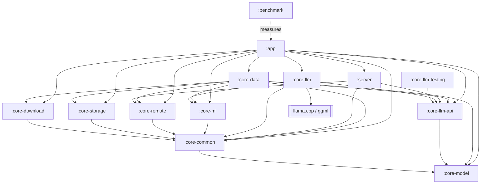

# OllamaMobile

[](https://github.com/jaypetez/ollama-mobile/actions/workflows/ci.yml)
[](https://github.com/jaypetez/ollama-mobile/actions/workflows/security.yml)
[](https://github.com/jaypetez/ollama-mobile/actions/workflows/docs.yml)
[](LICENSE)

OllamaMobile is an Android application designed to do three things: run GGUF language models
directly on the phone through llama.cpp; act as a complete client for a remote Ollama server, so a
box on your LAN — a Raspberry Pi, a desktop, a homelab machine — can do the heavy work while the
phone stays the interface; and expose its own Ollama-compatible HTTP API on the device, so
anything that already speaks the Ollama protocol can talk to the phone as if it were an Ollama
host. All three are designed to share one model catalogue, one chat surface and one routing layer,
so a conversation can move between a local model and a remote server without changing tools.

**Status: none of those three exist yet.** At 0.1.0 this repository is a build and a module
skeleton — see [Project status](#project-status) and [What is verified](#what-is-verified) before
reading anything below as a description of working software.

## Project status

Pre-1.0 and under active development. The version in `version.txt` is `0.1.0`. The public surface —
Gradle properties, the embedded server's endpoints, the on-disk model layout, the database schema —
should be treated as unstable until 1.0. There is no release on GitHub Releases yet; when there is,
it will be an APK, and nothing else. Breaking changes will be described in
[CHANGELOG.md](CHANGELOG.md) but will not be avoided before 1.0.

**Status: what exists at 0.1.0 is the build, not the app.** Thirteen Gradle modules configure and
assemble;
the layering gate runs; `Quantization` in `:core-model` is implemented and has 11 passing unit
tests. Beyond that, the Kotlin in this repository is `MainActivity`, `OllamaMobileApplication` and
an instrumentation test *runner* with no tests behind it. `:core-common`, `:core-remote`,
`:core-storage`, `:core-download`, `:core-data`, `:core-ml`, `:core-llm`, `:core-llm-api`,
`:core-llm-testing`, `:server` and `:benchmark` contain no sources at all, and there is no C or C++
anywhere. The `Not yet present` section of [CHANGELOG.md](CHANGELOG.md) is the authoritative
inventory.

Read [What is verified](#what-is-verified) before you rely on anything here.

## Features

**Status: this whole section is design, not implementation.** It describes what OllamaMobile is
being built to do and why it is shaped that way. It is the contract the implementation will be held
to, which is why it is written down in detail — but at 0.1.0 none of it is code you can run. Verbs
are future tense where the present tense would be a false statement of fact. The same convention is
used in [SECURITY.md](SECURITY.md) and, as a `Status` admonition, on the documentation site.

### Local inference

GGUF models will be executed on-device by llama.cpp, loaded through a JNI layer confined to exactly
one Gradle module (`:core-llm`). Streaming token output, cancellation, context management and
conversation state are to be handled above the JNI boundary in Kotlin. The native build is designed
to enable ggml's runtime CPU-variant dispatch (`GGML_BACKEND_DL`, `GGML_CPU_ALL_VARIANTS`) so a
single APK selects kernels appropriate to the CPU it finds at runtime rather than assuming a
baseline. ARM KleidiAI kernels are to be compiled in; note that they accelerate the legacy linear
quantisations (`Q4_0`, `Q8_0`) and the float formats, not the k-quants — `Q4_K_M` would get its
speed from ggml's own weight repacking instead. The model picker will state which is which rather
than implying blanket acceleration.

Local inference is optional at build time. With the default `-Pollama.nativeSource=none` there is no
native code in the APK at all — and today there is none under any value of the switch, because
`third_party/llama.cpp` and `core-llm/src/main/cpp/` do not exist.

### Remote Ollama client

Planned as a first-class client for the Ollama HTTP API: model listing, pulls, chat and generate
with streamed responses, multi-server configuration, and per-server credentials. Servers will be
addable by address or findable by discovery on the local subnet. The client is to be built on a
single shared OkHttp instance subject to the app's network policy, which can be locked to LAN-only
or fully offline; that policy is to be enforced in code at the DNS, interceptor and connection-event
layers rather than being left to a manifest setting (see [SECURITY.md](SECURITY.md) for why).
`:core-remote` is empty at 0.1.0, so none of this is written.

### Embedded API server

The phone is intended to serve the Ollama protocol itself, from a Ktor CIO server in the `:server`
module, binding to loopback by default. Exposing it to the LAN is designed to be an explicit,
per-session opt-in that generates a bearer token; a Host guard is to reject requests whose Host
header is not a private address, which is what would stop a browser on some other network using the
phone as a confused deputy. The server module is constrained by `checkModuleGraph` to depend only on
the inference *interface* and the remote DTOs — never on the database, the downloader or the native
engine — so it can be reasoned about, and tested, in isolation. That constraint is real and enforced
today; the server behind it is not written.

### Model management

Planned: a curated catalogue with parameter counts, quantisations and honest size arithmetic.
Estimated weight bytes are computed from the effective bits-per-weight of each quantisation,
including the block metadata that k-quants carry, so a `Q4_K_M` model is costed at ~4.85 bpw rather
than 4.0. That arithmetic is the one piece of this section that exists: it is `Quantization` in
`:core-model`, and it is unit-tested. Downloads are to be resumable, to run under WorkManager and to
be checksum-verified; the downloader is not written. Models will live in app private storage and are
already excluded from cloud backup and device transfer in the manifest rules, because a single GGUF
is larger than Android's entire 25 MB backup quota and one un-excluded file silently disables backup
for the whole app.

### Privacy

No telemetry. No analytics SDK, no crash-reporting SaaS, no remote logging, no unique identifiers,
no phone-home on first run. This is a constraint on the project, not a default setting: pull
requests that add any of those will be rejected. Crash capture, when it exists, writes to local
storage that the user can read and delete. Everything the app sends over the network goes to a
server the user configured or to a model file the user chose to download.

## Requirements

* Android 10 (API 29) or newer.
* An `arm64-v8a` device. Releases ship arm64 only. Debug builds additionally contain `x86_64`, which
  exists solely so instrumentation tests can run on a hosted-CI emulator; it is never released.
* Enough RAM for the model you intend to run locally. Remote-only use has no meaningful RAM floor.

The table below is arithmetic, not measurement: weights are `parameters x bits-per-weight / 8` at
`Q4_K_M` (4.85 bpw), and the device figure adds room for the KV cache, the runtime and the rest of
Android. Treat it as a planning guide, not a guarantee — no on-device measurements exist yet.

| Model size | Weights at Q4_K_M | Practical device RAM |
| ---------- | ----------------- | -------------------- |
| ~1B        | ~0.6 GB           | 4 GB                 |
| ~1.7B      | ~1.0 GB           | 4 GB                 |
| ~3B        | ~1.8 GB           | 6 GB                 |
| ~4B        | ~2.4 GB           | 6-8 GB               |
| ~7-8B      | ~4.3-4.9 GB       | 12 GB                |
| ~13B       | ~7.9 GB           | 16 GB, and expect it to be slow |

Two things make the device column larger than the weights column. The KV cache grows with context
length and is charged on top of the weights, and Android will kill a background process long before
the device is actually out of memory. Model weights are mapped natively rather than allocated on the
Java heap, so `largeHeap` is irrelevant here.

## Install

Distribution is **GitHub Releases only**. There is no Google Play listing and no F-Droid listing,
and neither is planned.

**There is nothing to install yet** — no release has been published. The procedure below is what it
will be:

1. Open [Releases](https://github.com/jaypetez/ollama-mobile/releases) and download
   `ollama-mobile-<version>-arm64-v8a.apk`.
2. Verify it against the `SHA256SUMS` file attached to the same release.
3. Allow installation from your browser or file manager when Android prompts, then open the APK.

Debug and release builds use different application IDs (`.debug` suffix), so a locally built debug
build can sit alongside an installed release.

## Build from source

### Prerequisites

* JDK 21. The Gradle toolchain requires it; bytecode target is 17.
* Android SDK with:
  * `platforms;android-37.0` — note the `.0`. compileSdk is 37 and it is installed as a
    minor-versioned platform.
  * `build-tools;36.0.0`
  * `cmdline-tools` rev 22.0
* Only if you want native code: `ndk;29.0.14206865` and `cmake;3.31.0`.

`scripts/setup-dev-env.ps1` checks for these and reports what is missing.

Gradle itself does not need to be installed — use the wrapper (9.6.1).

### Build

```sh
./gradlew assembleDebug
```

On Windows use `gradlew.bat`.

**This works with no NDK installed.** `-Pollama.nativeSource` defaults to `none`, which means
`:core-llm` compiles no C++, packages no `.so` and sets `BuildConfig.NATIVE_ENABLED=false`; once an
engine exists, this is where `StubLlamaEngine` will be bound. The resulting APK installs and starts
and shows a placeholder screen — at 0.1.0 there is no client and no UI behind it. The default exists
precisely so that a fresh clone builds on a machine that has never seen the NDK, and so that CI's
lint, unit-test and CodeQL jobs do not pay for a llama.cpp compile.

### Build with native code enabled

```sh
git submodule update --init --depth 1 third_party/llama.cpp
./gradlew assembleDebug -Pollama.nativeSource=build
```

The switch has three values:

| Value      | Effect |
| ---------- | ------ |
| `none`     | Default. No native code and no CMake; `StubLlamaEngine` will be bound once it exists. |
| `build`    | Compile llama.cpp from the `third_party/llama.cpp` submodule via CMake. Needs the NDK. |
| `prebuilt` | Package `.so` files already present in `core-llm/prebuilt/<abi>/`. No CMake, no NDK. |

Add `-Pollama.requireNative=true` to turn a silent fallback into a build failure — useful in
release pipelines, where quietly shipping a stub engine would be much worse than a red build.

Note that `third_party/llama.cpp` is not part of the repository yet; it lands in a later stage. Until
it does, `-Pollama.nativeSource=build` fails with an explanatory message and `prebuilt` requires you
to supply the `.so` files yourself.

### Other useful tasks

```sh
./gradlew test                # unit tests, all modules
./gradlew spotlessApply       # fix formatting
./gradlew spotlessCheck       # blocking format gate
./gradlew lintDebug           # blocking Android Lint gate
./gradlew checkModuleGraph    # blocking layering gate
./gradlew detekt              # advisory only; never fails the build
./gradlew koverXmlReport      # aggregated coverage -> build/reports/kover/report.xml
./gradlew assembleRelease bundleRelease
```

## Architecture

Thirteen Gradle modules plus an included build at `build-logic/` that holds the convention plugins.
The layering is not a convention that people are asked to remember: `checkModuleGraph` fails the
build on a violation, and it is part of `check`.

The modules and the edges below are real and enforced today. The types named in the rules that
follow — `LlamaEngine`, `InferenceGateway`, `FakeLlamaEngine` — are the design contract and are not
written yet.



The rules the graph check enforces:

* **Nothing depends on `:app`.** Shared types move down into `:core-model` or `:core-common`.
* **`:core-llm` is the only module that may see llama.cpp.** Everything else depends on
  `:core-llm-api`, the pure-JVM contract (`LlamaEngine`, `GenerationRequest`, `GenerationEvent`,
  `InferenceGateway`). That single rule is what makes `-Pollama.nativeSource=none` viable, what will
  let every consumer be unit-tested against `FakeLlamaEngine` with no device and no NDK, and what
  keeps the JNI blast radius to one module. Only `:app`, `:core-llm` itself and `:benchmark` MAY
  depend on `:core-llm`.
* **`:server` may depend only on `:core-llm-api` and `:core-remote`** (plus `:core-common`). It is
  explicitly forbidden from `:core-data`, `:core-storage`, `:core-download` and `:core-llm`, so
  hosting the API does not drag in Room, WorkManager and the downloader. The concrete
  `InferenceGateway` is bound at `:app` assembly.
* **`:core-model` is pure Kotlin** — no Android, no I/O — which is what makes it safe for the JVM
  modules to depend on.
* **`:core-data` is the aggregation layer** the UI talks to: repositories, the gateway
  implementation, the router that chooses between local and remote execution, and RAG
  orchestration.

`:core-ml` is deliberately not an inference accelerator. NNAPI is deprecated and neither it nor
LiteRT can execute GGUF; there is no format bridge. What is planned for it is CPU feature probing,
the feature-set-to-ggml-variant policy, a crash quarantine ledger for backends that fail, thermal
hints, and the int8 vector kernel RAG will use. The module is empty at 0.1.0.

## What is verified

Full detail: [docs/verification-status.md](docs/verification-status.md).

The short version, stated plainly:

* **There is no physical arm64 test device, and none is planned right now.** Everything that has run
  has run either on the JVM or on an `x86_64` emulator.
* **There is no native code in the repository yet.** At 0.1.0 the `third_party/llama.cpp` submodule
  is absent and `core-llm/src/main/cpp/` does not exist, so `-Pollama.nativeSource=build` fails by
  design with an explicit message. What is verified is the *absence path*: the app builds and
  packages with no NDK installed, binding a stub engine. See the CHANGELOG for what is and is not
  present.
* **Therefore this project publishes no performance numbers.** No tokens per second, no time to
  first token, no memory-under-load figures, no comparisons. There is a `:benchmark` module and it
  will produce real numbers when there is real hardware to produce them on. Until then, any number
  you see attributed to OllamaMobile did not come from here.

Claims elsewhere in the documentation are written to the same standard: if something has not been
observed, it is described as designed or intended, not as working.

## Screenshots

None yet, and there will be none until the UI is stable enough that a screenshot would not be
misleading. When they exist they will be here.

## Roadmap

Ordered roughly, not scheduled. Pre-1.0 means the order can change.

1. Land `third_party/llama.cpp` as a submodule and get `-Pollama.nativeSource=build` green in a
   dispatchable CI job.
2. Complete the remote Ollama client: chat, generate, pull, multi-server, discovery.
3. Chat UI with streaming, markdown and code highlighting.
4. Model catalogue, resumable downloads and integrity verification.
5. The embedded server: loopback, token-gated LAN exposure, Host guard, foreground-service
   lifecycle.
6. RAG over local documents using the int8 kernels in `:core-ml`.
7. Get real hardware, run `:benchmark`, and replace every "unverified" note in the docs with a
   measurement.
8. 1.0 when the public surfaces above stop moving.

## Contributing

See [CONTRIBUTING.md](CONTRIBUTING.md) for the development setup, the branching and commit rules,
the local gate to run before pushing, and concrete walkthroughs for adding a catalogue model, a
remote backend or an inference backend. Participation is governed by
[CODE_OF_CONDUCT.md](CODE_OF_CONDUCT.md). Security issues go through the process in
[SECURITY.md](SECURITY.md), not through public issues.

## Licence

MIT. Copyright (c) 2026 Jayson Petersen. See [LICENSE](LICENSE).

## Acknowledgements

Local inference exists because of [llama.cpp](https://github.com/ggml-org/llama.cpp) and
[ggml](https://github.com/ggml-org/ggml), MIT licensed, Copyright (c) 2023-2024 The ggml authors.
Attribution for llama.cpp and for the runtime dependencies is in [NOTICE](NOTICE) and
[THIRD_PARTY_LICENSES.md](THIRD_PARTY_LICENSES.md); the latter is also shipped inside the app so the
licences are readable without leaving it.
