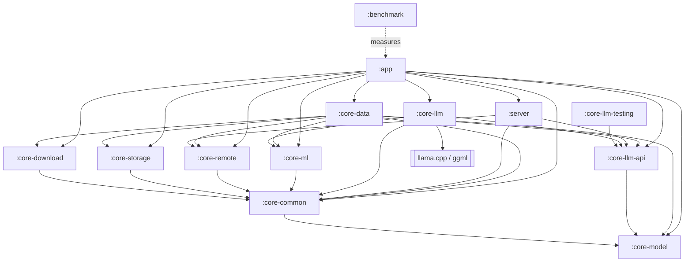

# OllamaMobile

[](https://github.com/jaypetez/ollama-mobile/actions/workflows/ci.yml)
[](https://github.com/jaypetez/ollama-mobile/actions/workflows/security.yml)
[](https://github.com/jaypetez/ollama-mobile/actions/workflows/docs.yml)
[](LICENSE)

OllamaMobile is an Android application designed to do three things: run GGUF language models
directly on the phone through llama.cpp; act as a complete client for a remote Ollama server, so a
box on your LAN — a Raspberry Pi, a desktop, a homelab machine — can do the heavy work while the
phone stays the interface; and expose its own Ollama-compatible HTTP API on the device, so
anything that already speaks the Ollama protocol can talk to the phone as if it were an Ollama
host. All three are designed to share one model catalogue, one chat surface and one routing layer,
so a conversation can move between a local model and a remote server without changing tools.

**Status: all three are written; none of the local-inference path has ever run on a real device.**
That distinction is the whole of what you need to know before reading further, and
[What is verified](#what-is-verified) spells it out. The remote-client path is ordinary HTTP and is
covered by tests against a mock server. The on-device path compiles, is unit-tested against a
scripted session, and has never produced a token on any phone, because there is no arm64 hardware
here to produce one on.

## Project status

Pre-1.0 and under active development. The version in `version.txt` is `0.1.0`. The public surface —
Gradle properties, the embedded server's endpoints, the on-disk model layout, the database schema —
should be treated as unstable until 1.0. There is no release on GitHub Releases yet; when there is,
it will be an APK, and nothing else. Breaking changes will be described in
[CHANGELOG.md](CHANGELOG.md) but will not be avoided before 1.0.

All thirteen modules have sources: 257 Kotlin files under `src/main`, 113 more under `src/test` and
`src/androidTest`, and roughly 1,010 test methods. The native layer is present too —
`core-llm/src/main/cpp/jni/llama_jni.cpp`, `native_crash_handler.cpp`,
`core-ml/src/main/cpp/ml_jni.c` and two `CMakeLists.txt` — with `third_party/llama.cpp` pinned as a
submodule at tag `b10150` (commit `dee2a846`).

What that count does *not* tell you is whether any of it works on a phone, and the honest answer for
the local-inference half is that nobody knows yet. Read
[What is verified](#what-is-verified) before you rely on anything here; it is the section that
distinguishes "tested" from "exercised on hardware", and the two are not close to the same thing in
this project.

## Features

Everything below is implemented. Present tense here means "the code exists and its tests pass", not
"this has been seen working on a phone" — for which see
[What is verified](#what-is-verified). Where something genuinely does not exist yet, it says so in
place.

### Chat

One conversation surface over both execution targets, with streamed responses, markdown rendering
and syntax-highlighted code blocks. Per-message generation stats, a sampler sheet (temperature,
top-k, top-p, context and prediction limits), a system-prompt sheet, and support for models that
emit reasoning tokens. The target can be switched mid-conversation. Conversations persist to Room
with full-text search over messages via FTS5, and can be exported.

The assistant's row is written to the database *before* the first token and then grown by a buffered
flush rather than on every token, because `messages` is an FTS5 external-content table whose trigger
reindexes the whole row on each write. If the process dies mid-answer, only the last unflushed
fragment is lost, and the interrupted turn is recovered and marked failed on next launch instead of
sitting there forever pretending to still be generating.

### Local inference

GGUF models are executed on-device by llama.cpp, loaded through a JNI layer confined to exactly one
Gradle module (`:core-llm`). Streaming token output, cancellation, context management and
conversation state are handled above the JNI boundary in Kotlin — tokens are *pulled* one at a
time
(`nativeGenerateNextToken` returns a `ByteArray?`) rather than pushed through a callback, which is
what makes backpressure fall out for free. The native build enables ggml's runtime CPU-variant
dispatch (`GGML_BACKEND_DL`, `GGML_CPU_ALL_VARIANTS`) so a single APK selects kernels appropriate to
the CPU it finds at runtime rather than assuming a baseline. ARM KleidiAI kernels are compiled in;
note that they accelerate the legacy linear quantisations (`Q4_0`, `Q8_0`) and the float formats,
not the k-quants — `Q4_K_M` gets its speed from ggml's own weight repacking instead. The model
picker states which is which rather than implying blanket acceleration.

Cancellation is handled in two layers, because the interesting case is a user pressing stop while
the engine thread is parked inside a multi-second `llama_decode` and cannot check anything:
`ensureActive()` between tokens, and a watchdog coroutine that calls the native abort from the
cancelling thread.

A crash inside a ggml kernel is treated as a first-class outcome rather than an impossibility. An
async-signal-safe native handler writes a record with no `malloc` and no JNI, a Kotlin sentinel is
armed immediately before the first decode and disarmed after the first token, and a backend that
kills the process once is quarantined so the next launch falls back to the baseline CPU path. The
first hardware to run these kernels will belong to a user, which is why that exists.

Local inference is optional at build time. With the default `-Pollama.nativeSource=none` there is no
native code in the APK at all, `StubLlamaEngine` is bound, and the app is a remote-only Ollama
client — which is also why a fresh clone builds with no NDK installed.

### Remote Ollama client

A first-class client for the Ollama HTTP API: model listing, pulls, chat and generate with streamed
responses, multi-server configuration, and per-server credentials held in an encrypted store. The
OpenAI-compatible API is spoken too. Servers can be added by address or found by discovery on the
local subnet, and each can pin its own TLS certificate. The client is built on a single shared
OkHttp instance subject to the app's network policy, which can be locked to LAN-only or fully
offline; that policy is enforced in code at the DNS, interceptor and connection-event layers rather
than being left to a manifest setting (see [SECURITY.md](SECURITY.md) for why). An architecture test
fails the build if anything outside `:core-remote` constructs its own `OkHttpClient`, or opens a
bare `java.net.Socket`, since a raw socket bypasses all three of those layers.

Which target answers a given request is decided per request. The router weighs a reachable LAN
server against the local engine, and the largest single term is whether the local model is already
resident in memory: answering from a loaded model starts decoding immediately, whereas answering
from a cold one means mapping several gigabytes and building a context first, during which a server
on the LAN has usually finished the whole reply. The decision is a pure function of a plain input
record, so every policy and tie-break is unit-tested without a network, a battery or a thermal
sensor.

### Embedded API server

The phone serves the Ollama protocol itself, from a Ktor CIO server in the `:server` module, binding
to loopback by default. It implements `/api/chat`, `/api/generate`, `/api/tags`, `/api/show`,
`/api/ps`, `/api/embed`, `/api/pull`, `/api/delete` and `/api/copy`, plus the OpenAI-compatible
`/v1/chat/completions`, `/v1/completions`, `/v1/models` and `/v1/embeddings`. Anything that already
speaks either protocol can point at the phone unmodified.

Exposing it to the LAN is an explicit, per-session opt-in that generates a bearer token; a Host
guard rejects requests whose Host header is not a private address, which is what stops a browser on
some other network using the phone as a confused deputy. The server module is constrained by
`checkModuleGraph` to depend only on the inference *interface* and the remote DTOs — never on the
database, the downloader or the native engine. That is a threat-model decision rather than
housekeeping: `:server` is the only inbound network surface in the app, and a handler that cannot
see the downloader cannot be tricked into starting a download.

### Model management

A curated catalogue with parameter counts, quantisations and honest size arithmetic. Estimated
weight bytes are computed from the effective bits-per-weight of each quantisation, including the
block metadata that k-quants carry, so a `Q4_K_M` model is costed at ~4.85 bpw rather than 4.0 —
and the KleidiAI acceleration flag is *derived* from that rather than declared, which is why it
comes out false for k-quants. Models can also come from a Hugging Face search or a pasted URL.

Downloads are resumable, run under WorkManager, and are checksum-verified, with sharded models
resolved to their parts. Models live in app private storage and are excluded from cloud backup and
device transfer in the manifest rules, because a single GGUF is larger than Android's entire 25 MB
backup quota and one un-excluded file silently disables backup for the whole app.

### Documents and retrieval

Retrieval over your own documents, entirely on-device. Text is extracted and chunked, embedded
through a second engine instance, and retrieved by combining BM25 over SQLite FTS5 with dense vector
search. The two are fused by reciprocal rank fusion rather than by blending normalised scores, since
one runaway BM25 score otherwise compresses everything else towards zero and quietly turns the
hybrid into a pure dense ranking. Indexing runs as a WorkManager job and citations are stored with
the answer.

### Privacy

No telemetry. No analytics SDK, no crash-reporting SaaS, no remote logging, no unique identifiers,
no phone-home on first run. This is a constraint on the project, not a default setting, and it is
enforced by a test that inspects the classpath rather than by policy — nobody adds an analytics
SDK on purpose; it arrives transitively and initialises itself from a merged `ContentProvider`
before
any of our code runs, which reviewing our own source cannot catch. There is a second test asserting
that the probe itself can fail, because a test that can only pass is worth nothing.

Crash capture writes to local storage the user can read and delete. Everything the app sends over
the network goes to a server the user configured or to a model file the user chose to download. The
database key can be gated behind biometric or device-credential unlock.

## Requirements

* Android 10 (API 29) or newer.
* An `arm64-v8a` device. Releases ship arm64 only. Debug builds additionally contain `x86_64`, which
  exists solely so instrumentation tests can run on a hosted-CI emulator; it is never released.
* Enough RAM for the model you intend to run locally. Remote-only use has no meaningful RAM floor.

The table below is arithmetic, not measurement: weights are `parameters x bits-per-weight / 8` at
`Q4_K_M` (4.85 bpw), and the device figure adds room for the KV cache, the runtime and the rest of
Android. Treat it as a planning guide, not a guarantee — no on-device measurements exist yet.

| Model size | Weights at Q4_K_M | Practical device RAM |
| ---------- | ----------------- | -------------------- |
| ~1B        | ~0.6 GB           | 4 GB                 |
| ~1.7B      | ~1.0 GB           | 4 GB                 |
| ~3B        | ~1.8 GB           | 6 GB                 |
| ~4B        | ~2.4 GB           | 6-8 GB               |
| ~7-8B      | ~4.3-4.9 GB       | 12 GB                |
| ~13B       | ~7.9 GB           | 16 GB, and expect it to be slow |

Two things make the device column larger than the weights column. The KV cache grows with context
length and is charged on top of the weights, and Android will kill a background process long before
the device is actually out of memory. Model weights are mapped natively rather than allocated on the
Java heap, so `largeHeap` is irrelevant here.

## Install

Distribution is **GitHub Releases only**. There is no Google Play listing and no F-Droid listing,
and neither is planned.

**There is nothing to install yet** — no release has been published. The procedure below is what it
will be:

1. Open [Releases](https://github.com/jaypetez/ollama-mobile/releases) and download
   `ollama-mobile-<version>-arm64-v8a.apk`.
2. Verify it against the `SHA256SUMS` file attached to the same release.
3. Allow installation from your browser or file manager when Android prompts, then open the APK.

Debug and release builds use different application IDs (`.debug` suffix), so a locally built debug
build can sit alongside an installed release.

## Build from source

### Prerequisites

* JDK 21. The Gradle toolchain requires it; bytecode target is 17.
* Android SDK with:
  * `platforms;android-37.0` — note the `.0`. compileSdk is 37 and it is installed as a
    minor-versioned platform.
  * `build-tools;36.0.0`
  * `cmdline-tools` rev 22.0
* Only if you want native code: `ndk;29.0.14206865` and `cmake;3.31.0`.

`scripts/setup-dev-env.ps1` checks for these and reports what is missing.

Gradle itself does not need to be installed — use the wrapper (9.6.1).

### Build

```sh
./gradlew assembleDebug
```

On Windows use `gradlew.bat`.

**This works with no NDK installed.** `-Pollama.nativeSource` defaults to `none`, which means
`:core-llm` compiles no C++, packages no `.so`, sets `BuildConfig.NATIVE_ENABLED=false` and binds
`StubLlamaEngine`. The resulting APK is a complete remote-only Ollama client: everything except
on-device inference works. The default exists precisely so that a fresh clone builds on a machine
that has never seen the NDK, and so that CI's lint, unit-test and CodeQL jobs do not pay for a
llama.cpp compile.

### Build with native code enabled

```sh
git submodule update --init --depth 1 third_party/llama.cpp
./gradlew assembleDebug -Pollama.nativeSource=build
```

The switch has three values:

| Value      | Effect |
| ---------- | ------ |
| `none`     | Default. No native code and no CMake; `StubLlamaEngine` is bound and the app is remote-only. |
| `build`    | Compile llama.cpp from the `third_party/llama.cpp` submodule via CMake. Needs the NDK. |
| `prebuilt` | Package `.so` files already present in `core-llm/prebuilt/<abi>/`. No CMake, no NDK. |

Add `-Pollama.requireNative=true` to turn a silent fallback into a build failure — useful in
release pipelines, where quietly shipping a stub engine would be much worse than a red build.

`third_party/llama.cpp` is pinned to the released tag `b10150` (commit `dee2a846`). The pin is
deliberate: upstream ggml moves fast and a floating submodule would mean the kernels change under
you between builds.

The value is read from the Gradle property alone and never inferred from whether the submodule
directory happens to exist. A filesystem probe at configuration time goes stale the moment the
submodule is initialised and poisons the configuration cache.

### Other useful tasks

```sh
./gradlew test                # unit tests, all modules
./gradlew spotlessApply       # fix formatting
./gradlew spotlessCheck       # blocking format gate
./gradlew lintDebug           # blocking Android Lint gate
./gradlew checkModuleGraph    # blocking layering gate
./gradlew detekt              # advisory only; never fails the build
./gradlew koverXmlReport      # aggregated coverage -> build/reports/kover/report.xml
./gradlew assembleRelease bundleRelease
```

## Architecture

Thirteen Gradle modules plus an included build at `build-logic/` that holds the convention plugins.
The layering is not a convention that people are asked to remember: `checkModuleGraph` fails the
build on a violation, and it is part of `check`.

The modules, the edges below and the types named in the rules that follow — `LlamaEngine`,
`InferenceGateway`, `FakeLlamaEngine` — all exist.



The rules the graph check enforces:

* **Nothing depends on `:app`.** Shared types move down into `:core-model` or `:core-common`.
* **`:core-llm` is the only module that may see llama.cpp.** Everything else depends on
  `:core-llm-api`, the pure-JVM contract (`LlamaEngine`, `GenerationRequest`, `GenerationEvent`,
  `InferenceGateway`). That single rule is what makes `-Pollama.nativeSource=none` viable, what lets
  every consumer be unit-tested against `FakeLlamaEngine` with no device and no NDK, and what keeps
  the JNI blast radius to one module. Only `:app`, `:core-llm` itself and `:benchmark` MAY depend on
  `:core-llm`.
* **`:server` may depend only on `:core-llm-api` and `:core-remote`** (plus `:core-common`). It is
  explicitly forbidden from `:core-data`, `:core-storage`, `:core-download` and `:core-llm`, so
  hosting the API does not drag in Room, WorkManager and the downloader. This is the threat-model
  rule described above, not a tidiness one. The concrete `InferenceGateway` is bound at `:app`
  assembly.
* **`:core-model` is pure Kotlin** — no Android, no I/O — which is what makes it safe for the JVM
  modules to depend on.
* **`:core-data` is the aggregation layer** the UI talks to: repositories, the gateway
  implementation, the router that chooses between local and remote execution, and RAG
  orchestration.

`:core-ml` is deliberately not an inference accelerator. NNAPI is deprecated and neither it nor
LiteRT can execute GGUF; there is no format bridge. What it holds instead is CPU feature probing,
the feature-set-to-ggml-variant policy, the crash quarantine ledger for backends that fail, thermal
hints, and the int8 vector kernel retrieval uses.

## What is verified

Full detail: [docs/verification-status.md](docs/verification-status.md).

The short version, stated plainly:

* **There is no physical arm64 test device, and none is planned right now.** Everything that has run
  has run either on the JVM or on an `x86_64` emulator.
* **On-device inference compiles. It has never run.** Not once, on any device. The JNI layer, the
  pull loop and the crash sentinel are unit-tested against a scripted session that stands in for
  llama.cpp, which exercises the bookkeeping and none of the arithmetic. Not a single token has been
  generated by this project. The instrumentation smoke test that would prove otherwise skips itself
  on the default `nativeSource=none` build and has not been run against a native one.
* **A green `./gradlew test` is not evidence that the app works.** Roughly 1,010 test methods pass;
  they are mostly JVM tests against fakes and mock servers. That is real coverage of logic and no
  coverage at all of a phone. The remote-client path is the part most likely to behave as described,
  because it is ordinary HTTP tested against `MockWebServer`.
* **Therefore this project publishes no performance numbers.** No tokens per second, no time to
  first token, no memory-under-load figures, no comparisons. There is a `:benchmark` module and it
  will produce real numbers when there is real hardware to produce them on. Until then, any number
  you see attributed to OllamaMobile did not come from here.

Claims elsewhere in the documentation are written to the same standard: if something has not been
observed, it is described as designed or intended, not as working.

## Screenshots

None yet, and there will be none until the UI is stable enough that a screenshot would not be
misleading. When they exist they will be here.

## Roadmap

Ordered roughly, not scheduled. Pre-1.0 means the order can change.

1. Get an arm64 device and generate one token. Everything below is downstream of that: until it
   happens, the local-inference half of this project is unproven and the honest word for it is
   "untested", not "beta".
2. Run the JNI smoke test against a `nativeSource=build` APK on real hardware, then widen the
   instrumentation suite, which is currently two files.
3. Run `:benchmark` and replace every "unverified" note in the docs with a measurement.
4. Publish the first release: an APK and a `SHA256SUMS`, and nothing else.
5. Screenshots, once the UI is stable enough that one would not be misleading.
6. 1.0 when the public surfaces stop moving.

## Contributing

See [CONTRIBUTING.md](CONTRIBUTING.md) for the development setup, the branching and commit rules,
the local gate to run before pushing, and concrete walkthroughs for adding a catalogue model, a
remote backend or an inference backend. Participation is governed by
[CODE_OF_CONDUCT.md](CODE_OF_CONDUCT.md). Security issues go through the process in
[SECURITY.md](SECURITY.md), not through public issues.

## Licence

MIT. Copyright (c) 2026 Jayson Petersen. See [LICENSE](LICENSE).

## Acknowledgements

Local inference exists because of [llama.cpp](https://github.com/ggml-org/llama.cpp) and
[ggml](https://github.com/ggml-org/ggml), MIT licensed, Copyright (c) 2023-2024 The ggml authors.
Attribution for llama.cpp and for the runtime dependencies is in [NOTICE](NOTICE) and
[THIRD_PARTY_LICENSES.md](THIRD_PARTY_LICENSES.md); the latter is also shipped inside the app so the
licences are readable without leaving it.
