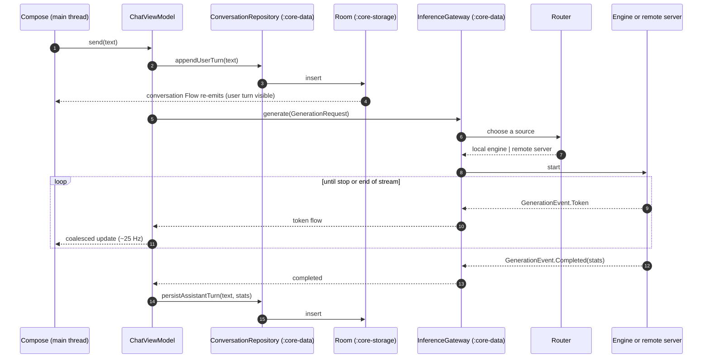
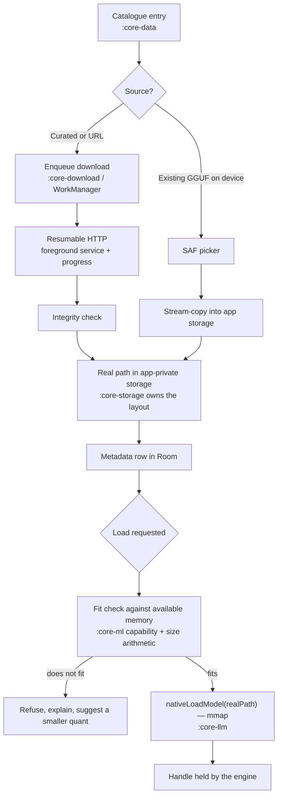
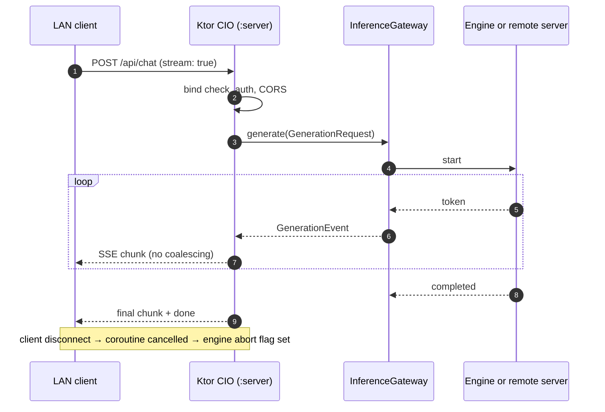

# Data flow

Three flows carry essentially everything the app does: a message becoming a
response, a catalogue entry becoming loadable weights, and an inbound HTTP
request becoming a stream. They converge in the same place, which is the point.

## A message becomes a response

Five details in there matter.

**The user's turn is persisted before generation starts.** It appears because
the database emitted, not because the ViewModel optimistically added it to a
list. There is one source of truth for conversation contents, and a process
death mid-generation loses the answer but never the question.

**The assistant's turn is persisted at completion, not per token.** Writing to
Room on every token would be a write amplification disaster and would make the
database the throughput bottleneck. The in-flight text lives in the ViewModel;
if the process dies mid-generation, the partial answer is gone. That is a
deliberate trade — a half-written answer is not worth a write per token.

**`GenerationRequest` and `GenerationEvent` are declared in `:core-llm-api`,**
a pure-JVM module. Nothing on this path needs Android to be exercised in a test.

**The router decides per request, not per session.** See
[Routing](../remote/routing.md).

**Coalescing happens between the gateway and Compose,** for the reasons in
[Threading](threading.md#the-ui-coalesces-tokens-at-25-hz).

## A model becomes loadable weights

The SAF branch copies rather than reading in place because weights are
memory-mapped by real path and a content URI cannot be mapped — see
[JNI boundary](jni-boundary.md). The fit check is arithmetic against reported
memory with a headroom margin, described in
[Memory](../local-inference/memory.md); it is a guard against the obvious
failure, not a guarantee.

Download state lives in Room, not in WorkManager's own bookkeeping, so the UI
can render a consistent list across process death. WorkManager owns the
scheduling; `:core-download` owns the meaning.

## An inbound request becomes a stream

The server converts an Ollama-shaped request into the same
`GenerationRequest` the UI produces, and converts `GenerationEvent`s back into
Ollama-shaped chunks. It is a translation layer over the gateway, not a second
inference stack — which is why `checkModuleGraph` can forbid it from touching
`:core-data`, `:core-storage`, `:core-download` and `:core-llm` without costing
any capability. See [Module map](module-map.md).

Unlike the UI path, the server does not coalesce. There is no renderer to
protect and an SSE consumer wants tokens as they arrive.

A client hangs up mid-stream and the Ktor coroutine is cancelled; that
cancellation reaches the same two-layer mechanism the stop button uses, so an
abandoned request stops costing CPU rather than running to completion into a
dead socket.

## Where state actually lives

| State | Home | Survives process death | Leaves the device |
| --- | --- | --- | --- |
| Conversations and turns | Room (`:core-storage`) | Yes | No |
| Model metadata and download state | Room | Yes | No |
| Settings and server list | DataStore | Yes | No |
| RAG index and embeddings | Room + files | Yes | No |
| In-flight assistant text | ViewModel | No | No |
| Loaded model weights | `mmap`, native | No | No |
| KV cache | Native | No | No |

Nothing in that table has a synchronisation path, because there is no backend to
synchronise with. See [Privacy](../privacy-policy.md).

## Backpressure end to end

Worth tracing once, because it is the property that keeps the app responsive
when something downstream is slow.

The engine loop pulls one token per call (see
[Threading](threading.md)), so if the consumer stops collecting, no token is
generated — the pull model makes backpressure the default rather than something
bolted on. The UI collector applies a fixed 25 Hz cadence, so a fast producer
cannot outrun the renderer. The server collector applies none, so a slow HTTP
client applies its own backpressure through the socket, which propagates back
through the flow to the engine. In every case the pressure ends up at the
generation loop, where the correct response — generate less — is the cheap one.
