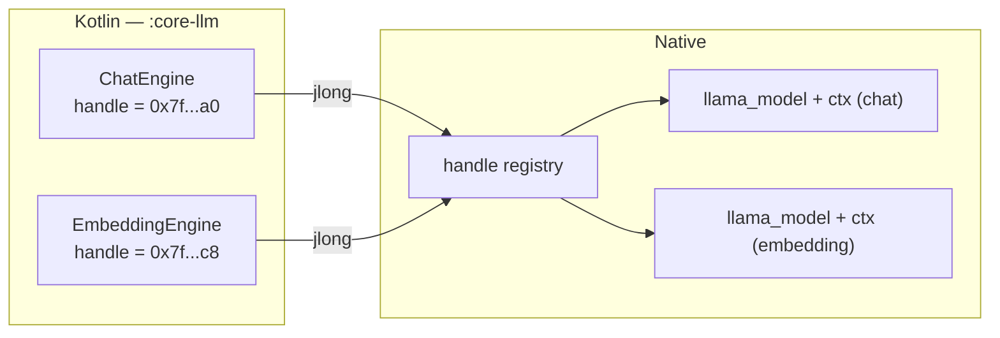

# JNI boundary

`:core-llm` is the only module that sees `llama.cpp`, and inside it the JNI
layer is deliberately small and deliberately boring. Four rules govern it. Each
one exists because the obvious alternative breaks in a specific, reproducible
way.

## Rule 1 — handles are `jlong`

Native objects are represented on the Kotlin side as an opaque `Long`. Nothing
else crosses.

```kotlin
internal class NativeModelHandle private constructor(private var handle: Long) {
    fun close() {
        if (handle != 0L) {
            nativeFreeModel(handle)
            handle = 0L
        }
    }
}

private external fun nativeLoadModel(path: String, params: Long): Long
private external fun nativeFreeModel(handle: Long): Unit
```

The alternative — a Java object whose fields native code reaches into with
`GetFieldID` / `SetLongField` — couples the C++ to the exact shape of a Kotlin
class. Rename the field, change its nullability, let R8 shrink it away, and you
get a `NoSuchFieldError` at runtime rather than a compile error. With a `jlong`
the only contract is "this integer is meaningful to native code", which no
refactoring tool can quietly invalidate.

Three consequences worth stating:

- **A zero handle is the null handle.** Every native entry point rejects `0`
  rather than dereferencing it. Double-free is prevented by zeroing the field
  first, as above.
- **Ownership is explicit.** The Kotlin object owns the handle and is the only
  thing that may free it. There is no finalizer; `Closeable` and structured
  lifecycle scoping do the work, because relying on the GC to release
  multi-gigabyte native allocations is how you get an out-of-memory kill.
- **Handles are validated, not trusted.** A handle arriving from Kotlin is
  checked against the live registry before use. This costs a lookup and turns
  a use-after-free from a native crash into a Kotlin exception.

## Rule 2 — `RegisterNatives` in `JNI_OnLoad`

Natives are bound explicitly at library load, not discovered by symbol name.

```cpp
static const JNINativeMethod kMethods[] = {
    {"nativeLoadModel", "(Ljava/lang/String;J)J", (void*) LoadModel},
    {"nativeGenerateNextToken", "(J)I", (void*) GenerateNextToken},
    {"nativeFreeModel", "(J)V", (void*) FreeModel},
};

extern "C" JNIEXPORT jint JNICALL JNI_OnLoad(JavaVM* vm, void*) {
    JNIEnv* env = nullptr;
    if (vm->GetEnv(reinterpret_cast<void**>(&env), JNI_VERSION_1_6) != JNI_OK) {
        return JNI_ERR;
    }
    jclass cls = env->FindClass("io/github/jaypetez/ollamamobile/llm/NativeBridge");
    if (cls == nullptr) return JNI_ERR;
    if (env->RegisterNatives(cls, kMethods, std::size(kMethods)) != JNI_OK) {
        return JNI_ERR;
    }
    return JNI_VERSION_1_6;
}
```

**Why this matters more on Android than elsewhere.** Implicit binding works by
mangling the fully qualified Java method name into a C symbol —
`Java_io_github_jaypetez_ollamamobile_llm_NativeBridge_nativeLoadModel`. That
name embeds the package and class. R8 in full mode — which this project enables
(`android.enableR8.fullMode=true`) — renames and repackages classes in release
builds. The mangled symbol no longer matches, and you get an
`UnsatisfiedLinkError` **only in release**, only after shrinking, typically
discovered by a user.

The usual workaround is a `-keep` rule on every class holding a native method,
which means an obfuscation exemption that must be maintained forever and that
silently rots when someone moves a class. `RegisterNatives` needs one `FindClass`
call with one string, so at most one `-keep` rule for one bridge class, and if
that string ever goes stale the failure is immediate and loud at library load
rather than at first inference.

Secondary benefits: binding fails fast and completely at load time instead of
lazily at first call; the JNI method table is a single readable list of the
entire native surface; and the C++ function names are free to be sensible rather
than 60-character mangled monsters.

## Rule 3 — no file-static globals

There is no `static llama_model* g_model;` anywhere in this layer, and no
process-wide "current context".

The reason is concrete rather than stylistic: **a chat model and an embedding
model must be loaded at the same time.** RAG needs an embedding model resident
while a conversation is running against a chat model. Those are two independent
`llama_model` objects, two contexts, two KV caches, two engine threads (see
[Threading](threading.md)) — and one global slot cannot hold two of anything.

The moment a global exists, someone writes `g_ctx` into a helper because it is
convenient, and the second model silently clobbers the first. The bug does not
appear until RAG is enabled, and when it does it looks like the chat model
producing garbage, which is the last place anyone thinks to look.

So every piece of state hangs off the handle. Native functions take a handle,
resolve it, and operate on that instance. The only process-wide state is the
handle registry itself and the ggml backend registration that `llama.cpp` does
internally at init.



This also means unloading one model cannot disturb the other, and a crash in one
backend does not require tearing down everything to recover.

## Rule 4 — models load by real path; SAF URIs are an import path only

`nativeLoadModel` takes a filesystem path. It never takes a content URI, and
there is no code path that streams a model into memory.

Weights are memory-mapped. `mmap` is not an optimisation here, it is the reason
loading a multi-gigabyte model on a phone is possible at all: the pages are file
-backed and clean, so the kernel can evict and re-read them under pressure
instead of the process holding the whole model as dirty anonymous memory. Read
the file into a buffer instead and you have committed every byte to RAM, doubled
peak usage during load, and made the low-memory killer's decision for it.

A Storage Access Framework URI cannot be mapped. It resolves through a
`ContentProvider`; what you can get from it is a `ParcelFileDescriptor`, and a
document provider is free to back that with a pipe, a network stream, or a file
in another app's sandbox that may be revoked between calls. Nothing about it
guarantees a stable, seekable, mappable region for the lifetime of the mapping.

Therefore:

- **Import** accepts a SAF URI. The file is copied — streamed once, with
  progress and integrity checking — into app-private storage.
- **Load** takes the resulting real path.

The copy is not a workaround waiting to be optimised away; it is the price of a
stable mapping, and it is paid once per model rather than once per load. The
cost is disk: an imported model exists twice until the user deletes the
original, which the import flow tells them. [Storage](../models/storage.md)
covers the layout and the cleanup.

## Error handling across the boundary

Native code never throws C++ exceptions across the JNI frame. Every entry point
is wrapped so that a `std::exception` becomes a thrown Java exception via
`ThrowNew`, and a failure that is expected rather than exceptional (out of
memory for the requested context, an unsupported GGUF version) becomes a status
code the Kotlin side maps to a typed error.

Note that `ThrowNew` sets a *pending* exception and does not unwind: the C++
function must `return` immediately afterwards. Every wrapper does this in one
place so no individual entry point has to remember.

The one thing native code never does is call back into Java. See
[Threading](threading.md) for why that is a load-bearing property rather than a
coincidence.

## Build-time context

The JNI layer compiles only when `-Pollama.nativeSource` is `build` or
`prebuilt`. With the default `none`, `BuildConfig.NATIVE_ENABLED` is `false`,
`StubLlamaEngine` is bound, and nothing above is loaded. The CMake flags used
for the `build` mode, including `GGML_BACKEND_DL` and `GGML_CPU_ALL_VARIANTS`,
are documented in [Native build](../local-inference/native-build.md).

!!! warning "Unverified on hardware"
    Everything on this page is a design contract, and the Kotlin half is
    exercised by unit tests against `FakeLlamaEngine`. The native half has not
    been run on a physical arm64 device — no mapping behaviour, no
    `RegisterNatives` release-build verification against a real R8 output, no
    two-models-resident memory measurement. See
    [Verification status](../verification-status.md).
