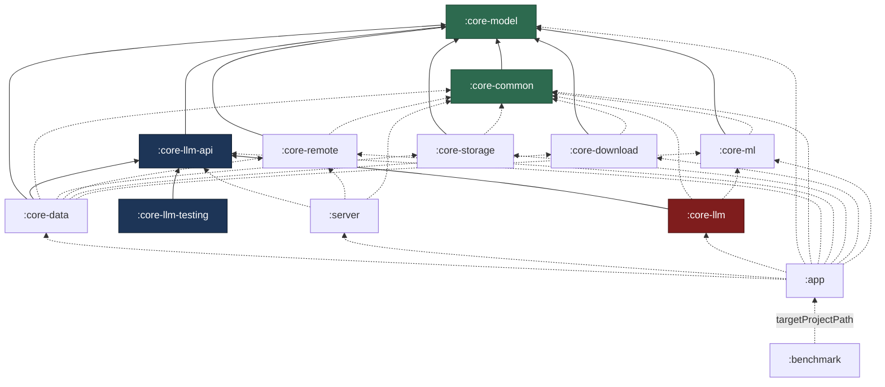

# Module map

Thirteen Gradle modules plus an included build at `build-logic/`. The split is
not decoration: three of the project's load-bearing properties — a build that
works with no NDK, a server that can be hosted without the app's data stack, and
unit tests that run on the JVM against fakes — are consequences of where these
boundaries fall. `./gradlew checkModuleGraph` fails the build when a dependency
crosses one of them.

## The modules

| Module | Type | Owns |
| --- | --- | --- |
| `:app` | Android application | Compose UI, navigation, ViewModels, Hilt wiring, foreground services. The **only** place the concrete engine, the server and the data stack are assembled together. |
| `:core-model` | Pure JVM | The vocabulary every other module speaks: `Quantization`, model identifiers, message and conversation types, server descriptors. No Android, no I/O, no dependencies on other project modules. |
| `:core-common` | Android library | The substrate: the single shared `OkHttpClient`, the network policy that enforces offline and LAN-only mode (`LanOnlyGuard`), structured logging, crash capture, the API inspector. |
| `:core-llm-api` | Pure JVM | The inference contract — `LlamaEngine`, `GenerationRequest`, `GenerationEvent`, `InferenceGateway`. Deliberately Android-free. |
| `:core-llm` | Android library | The **only** module that sees `llama.cpp`: the JNI layer, `NativeLlamaEngine`, `StubLlamaEngine`, model lifecycle, the engine thread. |
| `:core-llm-testing` | Pure JVM | `FakeLlamaEngine` and friends. Published as a normal artefact, not a test fixture, so any module — and the app's own debug build — can exercise inference paths with no native code. |
| `:core-ml` | Android library | Device capability: CPU feature probing, the feature-set → ggml CPU variant policy, the backend crash quarantine ledger, thermal and performance hints, the int8 vector kernel RAG uses. **Not an accelerator** — see below. |
| `:core-remote` | Android library | The remote client: Ollama and OpenAI-compatible HTTP, DTOs, streaming parsers, server health checks, discovery probes. |
| `:core-storage` | Android library | Room 2.8.4 database, DAOs, migrations, DataStore preferences, model file layout on disk. |
| `:core-download` | Android library | Model downloads via WorkManager: resumable transfers, integrity checks, progress reporting, foreground-service plumbing. |
| `:core-data` | Android library | Aggregation: repositories, the `InferenceGateway` implementation, the router that chooses local versus remote, RAG orchestration. The UI talks only to this module. |
| `:server` | Android library | The embedded Ollama-compatible HTTP server (Ktor CIO): routing, SSE streaming, CORS, auth, status pages. |
| `:benchmark` | Android test (`com.android.test`) | Macrobenchmark and baseline profile generation against `:app`. Only the `benchmark` variant is enabled — a debug build's numbers are meaningless. |

`build-logic/` is an included build, not a module. It holds the convention
plugins (`ollamamobile.android.library`, `ollamamobile.jvm.library`,
`ollamamobile.android.native`, `ollamamobile.android.hilt`, and so on) plus
`ModuleGraphConventionPlugin`, which is what registers `checkModuleGraph` in
every project.

!!! note ":core-ml is not an inference accelerator"
    It would be easy to imply otherwise and the implication would be false.
    NNAPI is deprecated, and neither NNAPI nor LiteRT can execute GGUF — there
    is no format bridge between them. `:core-ml` does CPU feature detection,
    variant policy, thermal hints and small numeric kernels. Nothing in it
    accelerates transformer inference. See
    [Backends](../local-inference/backends.md).

## The dependency graph

Solid arrows are `api` (the dependency is part of the consumer's own API);
dashed arrows are `implementation`.



Read it bottom-up: `:core-model` at the base knows nothing about anything;
`:app` at the top knows about everything and is the only module allowed to.

## The three rules

`CheckModuleGraphTask` inspects each project's own declared `api`,
`implementation`, `compileOnly` and `runtimeOnly` project dependencies and
rejects three patterns. Each project checks only itself — a root task walking
`subprojects { configurations }` would be cross-project configuration and would
stop Gradle's configuration cache from being stored at all, which matters on a
13-module build.

### Rule 1 — nothing may depend on `:app`

```text
:core-foo depends on :app  →  violation
```

**Why.** Dependency direction is the only thing keeping the graph acyclic and
the modules independently testable. The moment a core module reaches up into
`:app` for a type, that module can no longer be compiled, tested or reasoned
about without the entire application: its unit tests start needing Compose, its
build starts needing Hilt's app-level component, and the module boundary becomes
decorative. It is also the failure mode with the easiest accidental trigger —
someone puts a shared enum next to the screen that first used it, and the next
module that needs it takes the shortest path.

**What to do instead.** Move the shared type down. Pure data goes in
`:core-model`; anything Android-flavoured and cross-cutting goes in
`:core-common`. If the type genuinely belongs to the UI, the core module should
not have wanted it.

### Rule 2 — only `:core-llm` sees `llama.cpp`

Enforced as: only `:app`, `:core-llm` itself and `:benchmark` may declare a
dependency on `:core-llm`. Everything else depends on `:core-llm-api`.

```text
:core-data depends on :core-llm  →  violation, use :core-llm-api
```

**Why.** This is the rule that makes `-Pollama.nativeSource=none` work, and
therefore the rule that makes a fresh clone build with no NDK installed. If
`:core-data` or `:server` depended on the concrete engine, every consumer would
transitively require whatever `:core-llm` requires, and "the app is a pure
remote Ollama client when native code is absent" would stop being expressible.
CI would need an NDK for the lint job. A contributor would need a 2 GB toolchain
to fix a typo in a repository screen.

It buys two more things. Unit tests across the whole codebase can bind
`FakeLlamaEngine` from `:core-llm-testing` and run on the JVM in milliseconds,
because they depend on the interface. And a native crash has exactly one module
to be contained in — quarantining a misbehaving ggml backend is a policy change
in `:core-ml` plus a binding change in `:core-llm`, not a graph refactor.

`:benchmark` is on the allowed list because macrobenchmarking the native path is
the entire point of that module, and it targets `:app` anyway.

### Rule 3 — `:server` may not reach the app data stack

Forbidden targets for `:server`: `:core-data`, `:core-storage`,
`:core-download`, `:core-llm`.

```text
:server depends on :core-storage  →  violation
```

**Why.** The embedded server's job is to accept an HTTP request, hand it to an
`InferenceGateway`, and stream the result back. It has no business owning a
database connection, scheduling WorkManager jobs, or knowing that native
inference exists. Letting it depend on `:core-data` would drag Room, DataStore,
WorkManager, the downloader and the entire repository layer into a module whose
tests should be `ktor-server-test-host` plus a fake gateway and nothing else.

There is a second, sharper reason. `:server` is the only **inbound** network
surface in the product — the one component where a request originates outside
the device. Keeping its dependency set small is a security property, not just a
build-time nicety: a request handler that cannot see the download manager cannot
be tricked into starting a download, and one that cannot see `:core-storage`
cannot be tricked into reading the conversation database. The layering rule
turns "the server shouldn't do that" into "the server *can't* do that, and the
build proves it". See [Security model](../security-model.md).

The concrete gateway is bound at `:app` assembly, which is the only place that
knows about both the server and the data stack.

## Running the check

```bash
./gradlew checkModuleGraph
```

It is wired into `check`, so `./gradlew check` runs it too, and it is one of the
blocking jobs in CI. A violation prints the offending edge, the reason, and a
pointer back to this page. See [CI](../ci.md).

## Adding a module

1. Create the directory and a `build.gradle.kts` applying the right convention
   plugin — `ollamamobile.android.library` for Android, `ollamamobile.jvm.library`
   for pure JVM.
2. **Do not apply `org.jetbrains.kotlin.android`.** AGP 9.3.1 has Kotlin support
   built in; applying the standalone plugin on top of it is wrong and will
   misbehave. The convention plugins already handle it.
3. `include(":your-module")` in `settings.gradle.kts`, in the section that
   matches its layer.
4. Add it to the `kover(project(...))` list in the root `build.gradle.kts` if it
   contains production code. That list is explicit rather than derived from
   `subprojects` for the same configuration-cache reason as above.
5. Run `./gradlew checkModuleGraph test spotlessCheck`.
