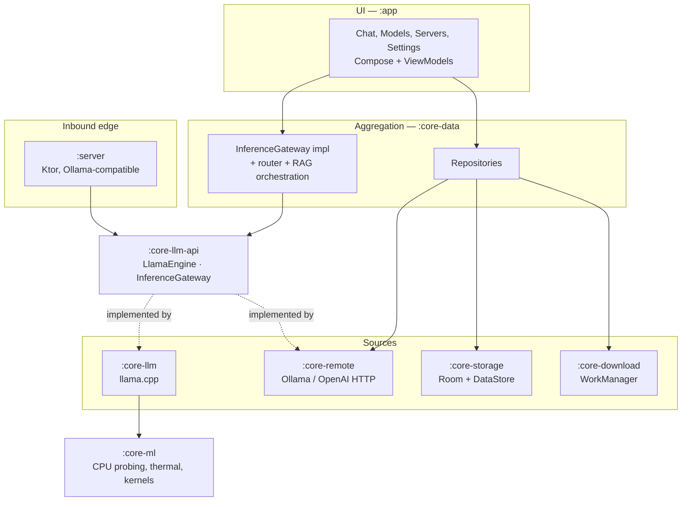
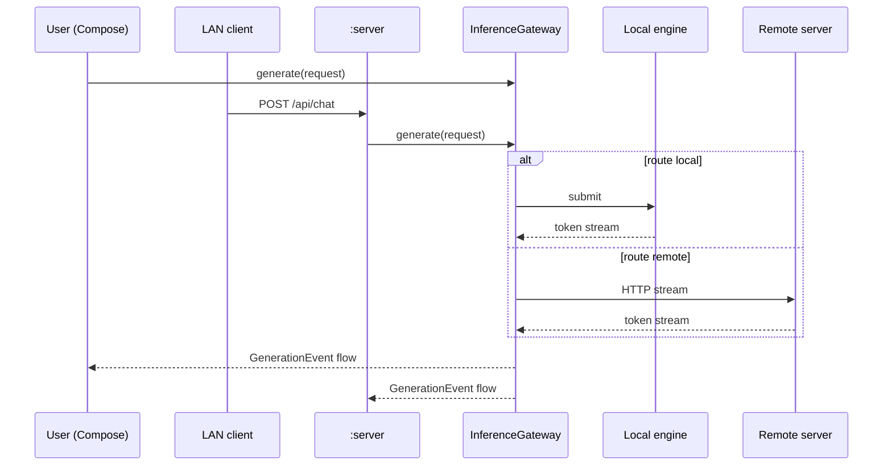

# Architecture overview

OllamaMobile is a single-process Android application with three inference
surfaces — a local `llama.cpp` engine, a remote Ollama client, and an embedded
HTTP server — sitting behind one shared contract. This page is the map; the
other pages in this section are the detail.

## The shape of it

Two things in that diagram do most of the architectural work.

**`:core-llm-api` is a pure-JVM contract.** `LlamaEngine`, `GenerationRequest`,
`GenerationEvent` and `InferenceGateway` are declared in a module with no
Android dependency and no native dependency. That is what lets `:server` accept
inference work without ever seeing Room or `llama.cpp`, and it is what lets
every consumer be unit-tested against `FakeLlamaEngine` on the JVM with no
device, no NDK and no Robolectric.

**The concrete engine is bound exactly once, at `:app`.** `:app` is the only
module that depends on `:core-llm`. With `-Pollama.nativeSource=none` that
module still resolves and compiles; it simply binds `StubLlamaEngine`. Nothing
else in the graph has to know.

## Request paths

Three ways a token gets produced, all funnelling into the same gateway:

The router that picks between local and remote lives in `:core-data` and is
described in [Routing](../remote/routing.md). Note that a request arriving on
the embedded HTTP server takes the same path as one from the UI — the server is
not a separate inference stack, it is another caller of the gateway.

## Layering

Thirteen Gradle modules, three enforced rules, one Gradle task
(`checkModuleGraph`) that fails the build when a dependency crosses a line it
should not. The rules exist to protect specific properties: the NDK-free build,
the hostability of the server, and the direction of dependency.

Full detail, including a per-module inventory and the reasoning behind each
rule, is in [Module map](module-map.md).

## Concurrency

One process. No `:llm` isolated process — the memory saved by an out-of-process
engine is more than eaten by the cost of shuttling weights and tokens across a
Binder boundary, and it would double the failure modes.

Each engine instance owns one dedicated OS thread, created and left alone for
its lifetime. Tokens are pulled from that thread by the Kotlin side rather than
pushed from native code, which removes the entire `AttachCurrentThread` /
`GlobalRef` callback apparatus. Cancellation is two-layer, because a
cooperative check between tokens cannot interrupt a multi-second prefill. The
UI coalesces tokens at roughly 25 Hz instead of recomposing per token.

Each of those decisions is argued in [Threading](threading.md).

## The native boundary

Handles are `jlong`, not Java objects wrapping pointers. Natives are bound with
`RegisterNatives` in `JNI_OnLoad`, which makes them immune to R8 renaming. There
are no file-static globals in the JNI layer, because a chat model and an
embedding model must coexist in one process. Model files are opened by real
path so they can be memory-mapped; SAF URIs are an import path only.

See [JNI boundary](jni-boundary.md).

## Data

State is local and lives in Room plus DataStore behind repositories in
`:core-data`. Nothing is synchronised to a server, because there is no server to
synchronise to. The flow of a message from keystroke to persisted turn, and the
flow of a model from catalogue entry to mapped weights, are traced in
[Data flow](data-flow.md).

## What this architecture is buying

- **A contributor can build and run the app with a JDK and an Android SDK.** No
  NDK, no submodule, no 20-minute first build.
- **CI can gate on real checks cheaply.** Unit tests run on the JVM against
  fakes, not on an emulator against a model file.
- **The server is genuinely separable.** It depends on an interface and three
  small modules, so it can be hosted, tested with `ktor-server-test-host`, and
  reasoned about without the app's data stack.
- **Native failure is contained.** One module sees `llama.cpp`. If the engine
  crashes, quarantining a backend is a policy decision in `:core-ml`, not a
  refactor.

## Where the honesty caveats live

Everything above is structural and verifiable by reading the build. The claims
that are *not* verified are behavioural and require ARM hardware: which CPU
variant gets selected, whether KleidiAI engages, real throughput, thermal
behaviour under sustained load, peak RSS, and low-memory-killer survival.
[Verification status](../verification-status.md) enumerates them.
