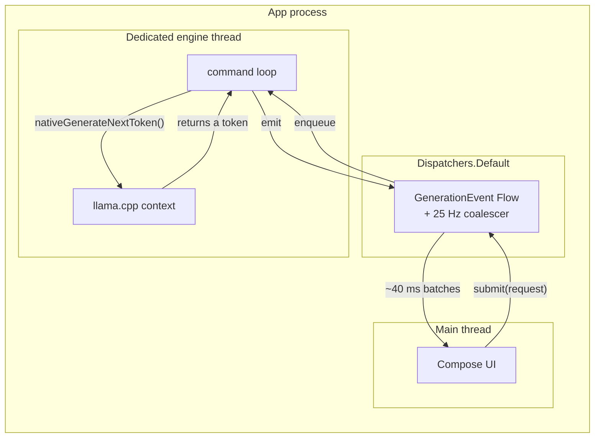
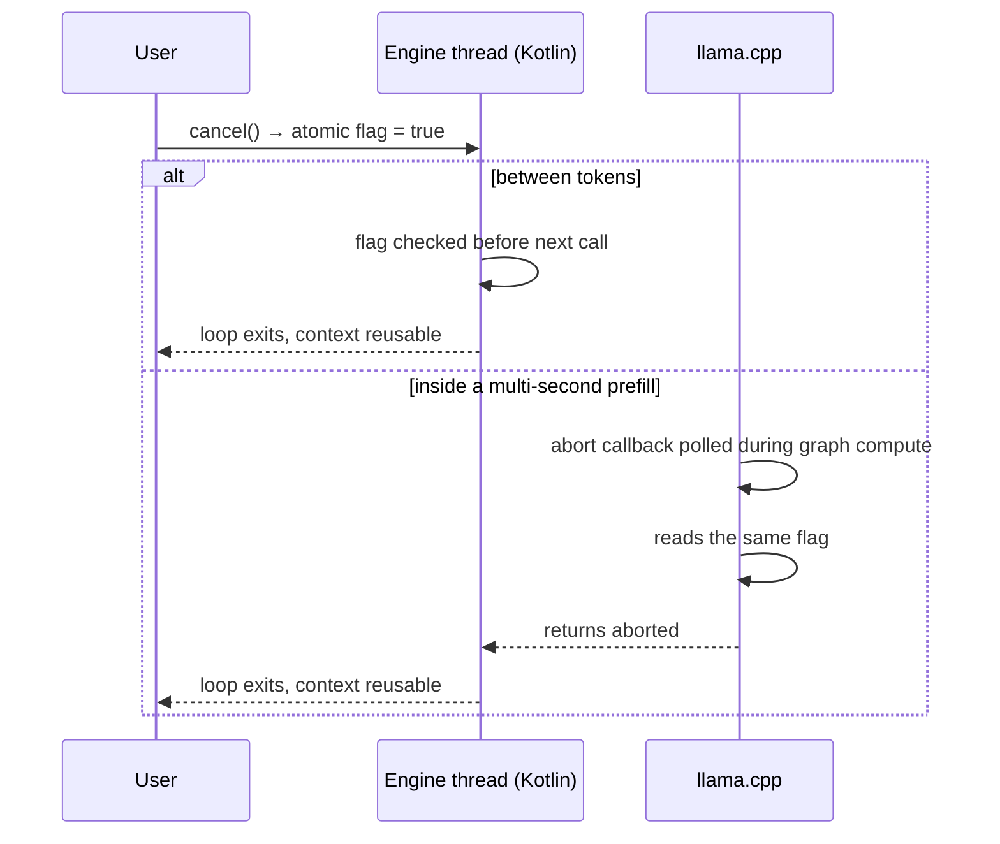

# Threading and cancellation

Four decisions define how inference concurrency works here: one process, one
dedicated OS thread per engine, a pull model for tokens, and two-layer
cancellation. A fifth — coalescing tokens before they reach Compose — is about
the UI but belongs on the same page, because it is the other half of the same
pipeline.

## One process

There is no `:llm` isolated process. Inference runs in the app process.

The tempting argument for a separate process is memory accounting: a native
crash takes down a child instead of the app, and Android's low-memory killer can
reap the child first. Both are real. Neither survives contact with what it
costs.

A multi-gigabyte model is memory-mapped from a file. Putting the engine in
another process does not halve that; it means the *other* process holds the
mapping and every token has to cross a Binder boundary to get back. Binder has a
transaction size limit measured in kilobytes and is not designed for a
high-frequency stream. You end up building a shared-memory ring buffer plus a
lifecycle protocol plus a death-recipient handler plus a reconnection path, and
each of those is a new failure mode that only shows up under memory pressure —
exactly the condition the split was supposed to help with.

The single-process design also keeps the honest failure honest: if the model
does not fit, the app is killed and the user finds out immediately, rather than
a child process being reaped silently and the UI showing a spinner forever.

!!! warning "Low-memory-killer behaviour is unverified"
    How Android actually treats this process under memory pressure with a large
    mapping resident has not been observed on a physical arm64 device. The
    reasoning above is design rationale, not a measurement. See
    [Verification status](../verification-status.md).

## One dedicated OS thread per engine

Each engine instance creates one OS thread when it starts and keeps it for its
whole lifetime. Not a coroutine dispatcher, not a pool, not `Dispatchers.IO`.

`llama.cpp` state is not thread-safe across concurrent calls on one context, and
more subtly, it is not *thread-agnostic*: the engine holds a KV cache and
scratch buffers whose locality assumptions are wired to whichever thread is
executing. A coroutine dispatcher is explicitly allowed to resume a suspended
computation on a different thread than the one it suspended on. If native calls
were dispatched over a pool, correctness would depend on a scheduling detail
nobody controls.

So the Kotlin side owns a thread, and every native call for that engine happens
on it. The thread is a plain `Thread` with a name that shows up in traces, and
it runs a small command loop. Two engines — one chat, one embedding — mean two
threads, which is the whole reason the JNI layer has no file-static globals
(see [JNI boundary](jni-boundary.md)).

Coroutines still describe the *outside* of this. `LlamaEngine` exposes a `Flow`
of `GenerationEvent`; the flow is produced on the engine thread and consumed
wherever the caller likes.



## Why tokens are pulled, not pushed

The obvious design is a callback: pass a Java object into native code, and have
the generation loop invoke a method on it once per token. Almost every JNI
tutorial does this. It is the wrong choice here.

To call back into the JVM from a thread that native code owns, that thread must
be attached with `AttachCurrentThread`, and the callback object must be held as
a `GlobalRef` because a local reference does not survive the native frame that
created it. That gives you:

- an attach/detach lifecycle to get exactly right, including on the abnormal
  paths, or the thread leaks and the JVM refuses to shut down cleanly;
- a `GlobalRef` that must be deleted on precisely one path, or it is a leak that
  pins a `ViewModel`-adjacent object for the process lifetime;
- a `jmethodID` cache that must be invalidated if the class is unloaded;
- exceptions: a Kotlin exception thrown inside the callback becomes a *pending*
  JVM exception in native code, which does not unwind anything. The C++ loop
  keeps running unless every call site remembers to check `ExceptionCheck()`.

The pull model deletes all of it. Native code exposes:

```kotlin
private external fun nativeGenerateNextToken(handle: Long): Int
```

The engine thread — a JVM thread, already attached, always — calls it in a loop.
Each call runs one decode step and returns one token, or a sentinel for
end-of-stream. Nothing native ever calls into Java. There is no attach, no
global reference, no method ID cache, no pending-exception hazard. A Kotlin
exception thrown while handling a token propagates normally through Kotlin
frames, because there are no native frames in between.

The loop looks roughly like this:

```kotlin
while (isActive) {
    val token = nativeGenerateNextToken(handle)   // one decode step
    if (token == TOKEN_EOS) break
    emit(GenerationEvent.Token(detokenize(token)))
}
```

Backpressure becomes free as well: if the consumer is slow, the loop simply does
not call `nativeGenerateNextToken` again, and no token is generated. In a push
model the native side has already produced the token and has to queue it
somewhere.

## Two-layer cancellation

Cancellation is checked in two places, because one is not enough.

**Layer 1 — cooperative, between tokens.** The loop above checks
`isActive` — and a plain atomic flag readable from the engine thread — before
each `nativeGenerateNextToken` call. This handles the normal case: the user hits
stop, the coroutine is cancelled, the next iteration does not happen, and the
context is left in a valid state for the next request.

**Layer 2 — an abort callback inside the native call.** Layer 1 can only act
*between* decode steps, and there is one step that is not short: prefill.
Ingesting a long prompt is a single native call that can run for seconds. During
it, a cooperative flag is never read, because control never returns to Kotlin.
A user who pastes three pages of text and immediately hits stop would watch the
button do nothing.

So the engine installs an abort callback with the native context — `llama.cpp`
invokes it periodically inside long-running graph computation — that reads the
same atomic flag and returns "abort". The prefill unwinds, the native call
returns an aborted status, and the loop exits.



Both layers read the same flag, so there is one source of truth and no window
where the two disagree. The important property afterwards is that the context is
still *usable*: cancellation is not an error path that requires tearing down and
reloading the model.

!!! note "Verified how"
    The cancellation state machine is covered by unit tests against
    `FakeLlamaEngine`, which models both layers. That proves the Kotlin side.
    Whether a real `llama.cpp` prefill actually honours the abort callback
    within a comfortable latency has not been observed on hardware.

## The UI coalesces tokens at ~25 Hz

Tokens do not go straight to Compose. They are batched and the UI is updated at
roughly 25 Hz — about every 40 ms.

Recomposing per token is wrong twice over. First, it is wasteful: a token is
often a few characters, and if generation is running well you would be asking
Compose to re-lay-out a growing markdown document faster than the display can
show it. Every one of those frames past the refresh rate is work the user never
sees. Second, and worse, the recomposition cost *grows with the message*.
Re-parsing and re-measuring a long markdown block is not free, so the longer the
answer gets the more the UI thread does per token, and the generation loop ends
up throttled by the renderer. The failure mode is a response that visibly slows
down as it gets longer — for reasons that have nothing to do with inference.

Coalescing decouples the two. The engine produces at whatever rate it produces;
the UI consumes a snapshot at a fixed cadence. 25 Hz is chosen because it is
fast enough to read as continuous streaming rather than chunked delivery, and
slow enough that the per-frame markdown cost stays bounded well under a frame
budget even for a long answer.

The coalescing happens above the engine, in the flow the ViewModel collects, so
it applies identically to local and remote generation — a remote server
streaming quickly hits the same batching. The HTTP server in `:server` does
**not** coalesce: an SSE client wants tokens as they arrive, and there is no
renderer to protect.

## Rules of thumb for contributors

- Never call a native engine method from anywhere but its own engine thread.
- Never wrap a native call in `withContext(Dispatchers.IO)` — the dispatcher may
  resume you elsewhere.
- If you add a native call that can run for more than a few tens of
  milliseconds, it needs abort-callback coverage, not just a flag check around
  it.
- If you add a UI surface that consumes tokens, consume the coalesced flow.
  Subscribing to the raw one to "get it faster" reintroduces the problem the
  coalescer exists to solve.
