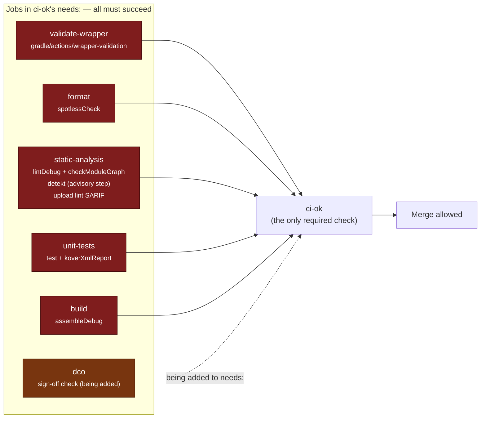
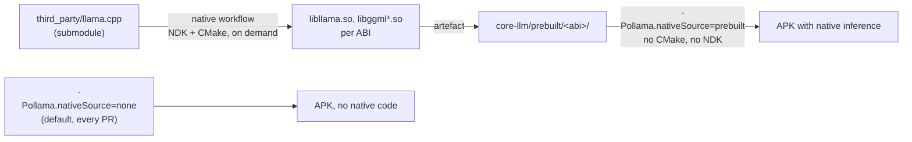

# Continuous integration

Every *Gradle* gate CI runs is reproducible locally with the wrapper. That is a
design rule, not a coincidence: if a check can only be run by pushing,
contributors cannot fix it, and nobody trusts it. The one exception is wrapper
validation, which by definition cannot be delegated to the wrapper it is
checking.

## The gate

Branch protection points at **one** required check: the `ci-ok` job in
`.github/workflows/ci.yml`. That job does no work of its own. It `needs:` the
jobs that matter and succeeds when they all did.

The indirection is worth the extra job. Required checks are configured in
repository settings, not in the repository, so every time a job is renamed or
split someone has to remember to update a settings page — and when they forget,
branch protection silently stops requiring the check that was renamed. With one
aggregating job the workflow can be reorganised freely and the protected check
name never changes.

**Advisory is a property of a step, not of a job.** There is no separate
"advisory job" outside the gate. `detekt` is a step *inside* `static-analysis`,
and `koverXmlReport` is a step *inside* `unit-tests` — both of which `ci-ok`
requires. Those steps cannot turn the gate red because their tasks cannot fail:
detekt runs with `ignoreFailures = true` and additionally carries
`continue-on-error: true` on the step, and `koverXmlReport` has no threshold. So
their output shows up in the run for a human to read and can never hold a merge,
while the blocking work that shares the job still gates normally.



`ci-ok` runs with `if: always()` and inspects `toJSON(needs)`, failing on any
result that is not `success`. That matters: without it a *skipped* or
*cancelled* dependency would satisfy a plain `needs:` and be mistaken for a
pass.

!!! note "A `dco` job is being added"
    Sign-off is required by [CONTRIBUTING.md](contributing.md) but is not
    machine-checked yet. A `dco` job is being added to `ci.yml` and to `ci-ok`'s
    `needs:`, at which point an unsigned commit blocks the merge instead of
    being caught in review. The diagram marks it as pending rather than claiming
    it already runs.

### What blocks a merge

| Check | Job | Command | Why it is a gate |
| --- | --- | --- | --- |
| Wrapper integrity | `validate-wrapper` | `gradle/actions/wrapper-validation` | A tampered `gradle-wrapper.jar` executes arbitrary code in every later job, so it is checked independently rather than trusted implicitly. Not a Gradle task; this is the one gate you cannot reproduce with `./gradlew`. |
| Formatting | `format` | `./gradlew spotlessCheck` | One tool, one Kotlin parser, deterministic output. Formatting arguments in review are a waste of everyone's time; a machine settles them. `./gradlew spotlessApply` fixes violations in place. |
| Android Lint | `static-analysis` | `./gradlew lintDebug` | Catches the Android-specific mistakes that compile fine — manifest problems, resource issues, API-level misuse. Configured by `config/lint/lint.xml`; the SARIF is uploaded to code scanning. |
| Module graph | `static-analysis` | `./gradlew checkModuleGraph` | The three layering rules in `ModuleGraphConventionPlugin`: nothing depends on `:app`; only `:app`, `:core-llm` itself and `:benchmark` may depend on `:core-llm`; `:server` may not depend on `:core-data`, `:core-storage`, `:core-download` or `:core-llm`. Without this gate they are a comment in a doc. See [Module map](architecture/module-map.md). |
| Unit tests | `unit-tests` | `./gradlew test` | All modules, on the JVM — no emulator, no device, no NDK. **Read the caveat below before treating a green run as coverage.** |
| Debug build | `build` | `./gradlew assembleDebug` | Proves the app still assembles — with the default `-Pollama.nativeSource=none`, on a runner with no NDK installed. |

!!! warning "A green `test` job is not evidence of coverage"
    `failOnNoDiscoveredTests` is `false` in the convention plugin, so a module
    with no tests reports success rather than failing. At 0.1.0 only
    `:core-model` has any tests — 11 of them. The other twelve modules
    contribute a green tick and nothing else. This gate protects the tests that
    exist; it says nothing about the ones that do not.

Run the five Gradle gates before pushing:

```bash
./gradlew spotlessCheck lintDebug test checkModuleGraph assembleDebug
```

### What does not block a merge

Both of these run as steps inside jobs that *are* required. They do not block
because the tasks themselves cannot fail, not because they were left out of
`ci-ok`.

**detekt.** `./gradlew detekt` runs from the root over every module's `src/main`
and `src/test`, as a step in the `static-analysis` job. It is configured with
`ignoreFailures = true` in `build.gradle.kts`, and the step additionally carries
`continue-on-error: true` — belt and braces, because `ignoreFailures` covers
findings but not the analyser crashing on syntax it has not caught up to.

This is deliberate and it is not laziness. The only detekt release line that
understands this project's Kotlin is `dev.detekt` **2.0.0-alpha.5** — an alpha.
An alpha static analyser built against a moving Kotlin frontend will produce
false positives, will crash on syntax it has not caught up to, and will change
its findings between patch releases. Giving that veto power over a merge means
an unrelated dependency bump can block work that is perfectly correct, and the
inevitable response is people learning to bypass the gate — which costs more
than the tool was ever going to save.

So detekt is a signal. Read its output, fix what it is right about, ignore what
it is wrong about. When the release line stabilises, this decision gets
revisited; until then Spotless and Android Lint are the gates, and between them
they cover formatting and the Android-specific correctness classes that actually
bite.

**Coverage.** `./gradlew koverXmlReport` aggregates to
`build/reports/kover/report.xml`, as a step in the `unit-tests` job alongside
`test`. It is reported, not thresholded. A coverage minimum turns into tests
written to move a number rather than to catch a bug. The report is uploaded to
Codecov only when `CODECOV_TOKEN` is set, and with `fail_ci_if_error: false`, so
a Codecov outage cannot fail a legitimate pull request.

## The workflows

### `ci.yml` — pull requests and pushes to `main`

The gate above. Key properties:

- Runs with the **default** `-Pollama.nativeSource=none`. The runner needs a JDK
  and an Android SDK, and nothing else. No NDK, no CMake, no submodule, no
  20-minute native build on every pull request. This is the single biggest
  reason CI is fast, and it is a direct consequence of the layering rule that
  keeps `llama.cpp` behind `:core-llm-api`.
- **There is no remote build cache.** `settings.gradle.kts` declares no
  `buildCache { remote(...) }` block and there is no cache server to point one
  at. What speeds runs up is three unrelated things: the *local* build cache
  (`org.gradle.caching=true` in `gradle.properties`), the configuration cache
  (`org.gradle.configuration-cache=true`), and whatever
  `gradle/actions/setup-gradle` restores from the GitHub Actions cache — the
  wrapper distribution, `~/.gradle` state and the local cache directory. That
  action is configured to write the cache only from the default branch and to
  run read-only everywhere else, so a pull request cannot overwrite the shared
  entry with state derived from unreviewed code.
- Concurrency is grouped per ref with cancel-in-progress, so a force-push does
  not leave a stale run burning minutes.
- Every Gradle job goes through the `./.github/actions/setup-android-build`
  composite, so JDK 21, Gradle caching and Android SDK licence acceptance are
  identical across jobs rather than copy-pasted five times.
- `ci-ok` aggregates.

### `docs.yml` — this site

Builds with `mkdocs build --strict` and deploys to GitHub Pages on pushes to
`main` that touch `docs/`, `mkdocs.yml` or the workflow itself. Pull requests
build without deploying.

Strict mode is the point. It turns every MkDocs warning into an error, so a page
listed in `nav` that does not exist, or a relative link that does not resolve,
fails the build instead of shipping a dead link. Python dependencies are pinned
exactly in `docs/requirements.txt` for the same reason the Gradle catalogue is
pinned: a docs build that changes behaviour because a theme released is worse
than one that fails on an intentional bump.

Build it locally the same way CI does:

```bash
python -m pip install -r docs/requirements.txt
mkdocs serve            # live preview at http://127.0.0.1:8000
mkdocs build --strict   # exactly what CI runs
```

### `native-build.yml` — keyed, separate, and not on the merge path

Compiling `llama.cpp` for Android is expensive and it needs things ordinary CI
does not have: the NDK, SDK CMake, and the `third_party/llama.cpp` submodule.
`:core-llm` is to build ggml with `-DGGML_CPU_ALL_VARIANTS=ON`, which compiles
the CPU backend once per variant per ABI; on a cold ccache that is tens of
minutes. Putting it on the pull-request path would add that to every run,
including the ones that only touch a README.

So it is a separate workflow with three properties:

**It is keyed — it runs when the native inputs move, or on demand.** There are
exactly three triggers, and none of them is a tag:

| Trigger | Purpose |
| --- | --- |
| `workflow_dispatch` | Bare — no inputs. Run it by hand when you want fresh `.so` files. |
| `workflow_call` | So another workflow can invoke it as a reusable job. |
| `push` filtered by `paths` | Fires only on changes to `core-llm/src/main/cpp/**`, `.gitmodules`, `gradle/libs.versions.toml`, or the workflow file itself. Those are the four things that can change the output. |

There is no ABI input and no submodule-ref input: the job builds `arm64-v8a` and
`x86_64` unconditionally, and the submodule commit is whatever the checkout
resolves. Nobody pays the cost by accident, and nobody has to remember to
dispatch it after bumping the pinned NDK.

**It is guarded.** `third_party/llama.cpp` **does not exist in the repository
yet** — it lands in a later stage. The first step checks for
`third_party/llama.cpp/CMakeLists.txt` and, when it is absent, every subsequent
step is skipped by an `if:` and the job exits green with an explanatory notice.
Without that guard a push touching `gradle/libs.versions.toml` would turn the
repository red for a submodule nobody has added, and a permanently red workflow
trains people to ignore red workflows.

**Its ccache key is the honest one.** Two things decide whether an object file
is still valid — the llama.cpp commit, and the flags it was compiled with — so
the key hashes the submodule SHA together with the convention plugin, the JNI
sources and the version catalogue.

**Its output feeds the prebuilt mode.** The `.so` files it produces are the
input to `-Pollama.nativeSource=prebuilt`:



The prebuilt mode exists precisely so that a job which *needs* native code in
the APK — an instrumentation run, a release candidate — can have it in seconds
by consuming an artefact, instead of rebuilding a large C++ project. The
convention plugin implements it as "no CMake at all, just add
`core-llm/prebuilt/` to `jniLibs.srcDirs`", which is about as cheap as it gets.
See [Native build](local-inference/native-build.md).

!!! note "Nothing consumes prebuilt artefacts today"
    With no submodule there are no `.so` files, so `prebuilt` has nothing to
    pick up at 0.1.0. The switch and the plumbing are in place so that the
    pipeline does not have to be redesigned when the submodule lands.

### `release.yml` — tags

Runs on `v*` tags. Builds signed release artefacts, attests build provenance and
attaches everything to the GitHub release. There is no Play Store step, no
fastlane, no Play service-account secret, because distribution is GitHub
Releases only. The exact filenames it publishes are listed in
[Release process](release-process.md).

Four things about it are easy to get wrong and are therefore worth stating here:

- It checks out with `submodules: recursive` and installs the NDK and CMake,
  because unlike every other workflow it compiles `llama.cpp`:
  `-Pollama.nativeSource=build -Pollama.requireNative=true`. Without
  `requireNative` a missing submodule would silently produce a stub build.
- It fails if `native-debug-symbols.zip` or `mapping.txt` is absent. Both are
  produced by tasks that *warn* rather than fail when their tooling is missing,
  so the artefact check is the only thing standing between a bad configuration
  and an unsymbolicatable release.
- It runs `scripts/verify-16kb-alignment.sh` over the staged APK and AAB before
  publishing. That is an ELF `p_align` check, not a zipalign check.
- It never runs for a tag pushed by `GITHUB_TOKEN`, which is why
  `release-please.yml` pushes tags with the `RELEASE_PLEASE_TOKEN` PAT. A tag
  created with `GITHUB_TOKEN` produces no workflow run and no error.

Signing secrets (`OLLAMA_KEYSTORE_BASE64`, `OLLAMA_KEYSTORE_PASSWORD`,
`OLLAMA_KEY_ALIAS`, `OLLAMA_KEY_PASSWORD`) are exposed to this workflow only.

### `instrumentation.yml` — emulator tests, gated on there being any

Runs on pull requests and on demand. A `guard` job first probes the `androidTest`
source set for a `@Test`; the expensive emulator job is `needs:`-gated on it. At
0.1.0 that probe finds nothing — `app/src/androidTest/` holds a test *runner* and
no test classes — so the emulator never boots. Booting an emulator to run zero
tests on every pull request is pure waste; a guard is cheaper than a convention
nobody remembers. It is not part of `ci-ok`.

### `nightly-benchmark.yml` — scheduled, currently a no-op

Runs at 04:17 UTC daily and on demand, with the same guard shape: a `guard` job
checks for `benchmark/src` and the benchmark job is skipped when it is absent,
which it is at 0.1.0. See [Nightly benchmark CI](benchmarking/nightly.md) for
what it does and, more importantly, why its numbers are a relative regression
signal and never device performance.

### `security.yml` and `scorecard.yml`

CodeQL for `java-kotlin` on pull requests, pushes to `main` and weekly; CodeQL
for `c-cpp` weekly only, and currently no-oping because there is no C or C++ in
the repository. Plus gitleaks, dependency review, OSV against the resolved
Gradle graph, and OpenSSF Scorecard. None of these are in `ci-ok`. Details and
the known gaps are in
[SECURITY.md](https://github.com/jaypetez/ollama-mobile/blob/main/SECURITY.md).

### Dependency updates

Dependabot opens pull requests against `gradle/libs.versions.toml`, the GitHub
Actions used in workflows, and `docs/requirements.txt`. Each one goes through
the same `ci-ok` gate as any other change, which is the entire argument for
pinning: a bump is a reviewed commit that CI proved, not something that happened
to you overnight.

Two pairings in the catalogue are load-bearing and must move together: Kotlin
with the Compose compiler plugin (same coordinate version), and Kotlin with KSP
(KSP trails Kotlin — check the KSP release notes before bumping Kotlin).

**llama.cpp is deliberately not one of them.** Dependabot's `gitsubmodule`
ecosystem is switched off in `.github/dependabot.yml`, and must stay off. The
submodule is bumped by exactly one automated mechanism —
`.github/workflows/llamacpp-bump.yml`, monthly or on demand with a tag input,
which opens a pull request naming the upstream tag, linking the upstream compare
view and listing the ABI review a human has to do first. Locally, the equivalent
is `scripts/update-llamacpp.sh <tag>`, which stages the gitlink and prints the
upstream log without committing.

The reason for one path rather than two is specific: a gitlink change can alter
the ABI that `:core-llm`'s JNI layer binds against, Dependabot would open it as
a bare SHA bump with no release notes and no changed-symbol summary, and two
bots proposing the same bump is how that gets merged as "just a dependency
update". CI runs with `-Pollama.nativeSource=none` and never compiles this code,
so a green CI proves nothing about it, and there is no arm64 device here to
catch the break before users do. Both paths are inert at 0.1.0: there is no
submodule to move.

## What CI does not do

Worth stating, so nobody assumes a check exists that does not.

- **No instrumentation test has ever executed.** `instrumentation.yml` exists
  and is wired up, but its guard correctly finds zero `@Test` methods in
  `androidTest`, so the emulator job is skipped on every run. The `x86_64` debug
  ABI is there so that they *can* run once they are written.
- **No device testing of any kind**, and there will not be until physical arm64
  hardware exists. See [Verification status](verification-status.md).
- **No performance regression gate in practice.** `nightly-benchmark.yml` is
  scheduled and would compare against a stored baseline, but `:benchmark` has no
  sources, so the job no-ops every night and has never produced a number.
- **No release signing on pull requests.** Signing material is available only to
  the tag-triggered release workflow.
- **No dependency-graph coverage from dependency review.** GitHub does not parse
  Gradle builds, so that check currently passes trivially; OSV is what actually
  looks at the resolved dependency set.

## Adding a check

If you want a new gate:

1. Make it runnable locally with `./gradlew <task>`. If a contributor cannot
   reproduce it, it is not a gate, it is an obstacle.
2. Add it as its own job in `ci.yml` and to the `needs:` list of `ci-ok`. Do not
   touch branch protection — that is the point of `ci-ok`.
3. Document it in the table above.
4. If it is flaky or built on pre-release tooling, make it advisory. There is
   already one example of that judgement call on this page.
