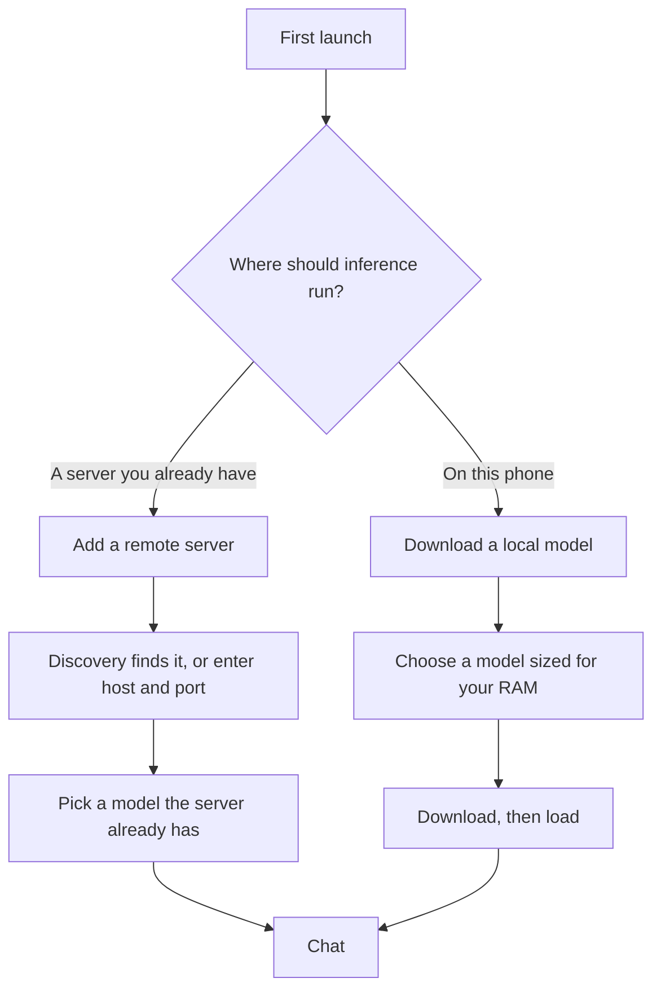

# First run

The app opens straight into a chat screen with no account, no sign-in and no
onboarding survey. Before it can answer anything, though, it needs somewhere to
run inference. There are two options and you can use both at once.

## Option A — connect to a server you already run

This is the fastest route and it works on any phone, including one with too
little RAM to run a model locally.

1. Open **Servers**.
2. Tap **Scan network**. Discovery probes the local subnet for Ollama's default
   port and lists anything that answers. If your server is on a non-standard
   port, or reachable only over a VPN, add it by hand instead.
3. Tap **Add server** for a manual entry. A bare host and port is enough:
   `192.168.1.50:11434`, or `pi.local:11434`, or a Tailscale name.
4. The app fetches the server's model list. Pick one and start a conversation.

Ollama on another machine listens on `127.0.0.1` by default and will not answer
from the network. On the server, set `OLLAMA_HOST=0.0.0.0:11434` and restart it.
See [Discovery](../remote/discovery.md) for what the scan does and does not
probe, and [Auth and TLS](../remote/auth-tls.md) for reverse proxies, bearer
tokens and HTTPS.

!!! note "Plain HTTP to a LAN address is allowed on purpose"
    Ollama on a Raspberry Pi is HTTP on port 11434, and there is no certificate
    to be had. The app permits cleartext at the platform layer and restricts it
    in code instead, because an Android network security config physically
    cannot express "private ranges only". The full argument is in
    [Security model](../security-model.md).

## Option B — run a model on the phone

1. Open **Models**.
2. The catalogue marks each entry against your device's memory. Start small: a
   1–2 B parameter model at `Q4_K_M` is the sane first choice on almost any
   handset.
3. Download it. Downloads run in a foreground service and survive the app being
   backgrounded; they resume after an interrupted connection.
4. Tap **Load**. Loading maps the weights into memory and prepares a context;
   this takes a moment and is not the same thing as generation being slow.
5. Go back to chat and send a message.

[Requirements](requirements.md) explains how to work out what your device can
actually hold. [Downloading](../models/downloading.md) and
[Storage](../models/storage.md) cover where files go and how to import a GGUF
you already have.

!!! warning "Local generation speed is unmeasured"
    This project has never run inference on a physical arm64 device, so it makes
    no claim about how fast local generation will be on yours, and publishes no
    tokens-per-second figures anywhere. If it feels slow,
    [Tuning](../local-inference/tuning.md) lists the knobs and
    [Troubleshooting](../troubleshooting.md) covers the common causes. See
    [Verification status](../verification-status.md) for the full list of what
    is and is not proven.

## Option C — serve the phone's model to other machines

Once a local model is loaded, the phone can expose an Ollama-compatible HTTP API
on the LAN. It is off by default and never binds automatically.

1. Open **Server** and turn it on. It binds to the device's LAN address on the
   port you choose.
2. Point any Ollama client at `http://<phone-ip>:<port>`.

Read [Enabling LAN access](../server/enabling-lan.md) before you do this — it is
the one feature that turns the phone into a listening service, and the page
explains what that exposes. [Endpoints](../server/endpoints.md) lists the routes
implemented and the ones deliberately not implemented.

## What the app did and did not do while you were reading this

It made no network request you did not initiate. It sent no analytics event,
because there is no analytics code in the binary. It created a local database
for your conversations and settings, and nothing else.
[Privacy](../privacy-policy.md) is specific about this.

## Where to go next

- [FAQ](faq.md) — the questions that come up first.
- [Routing](../remote/routing.md) — how the app decides between the local engine
  and a remote server when both are available.
- [Architecture overview](../architecture/overview.md) — if you are here to read
  the code rather than use the app.
