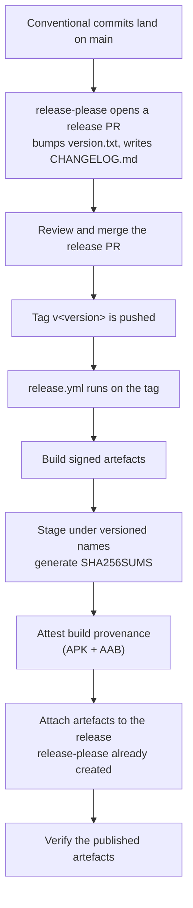

# Release process

Distribution is **GitHub Releases only**. No Google Play, no F-Droid, no
fastlane, no store metadata, no Play service-account secret anywhere in the
repository. If you find an OllamaMobile listing on an app store, it is not this
project.

Current version: **0.1.0**.

## Versioning

One file is authoritative: `version.txt` at the repository root. Nothing else
carries a version string.

`app/build.gradle.kts` reads it and derives both Android version fields:

```kotlin
versionName = "1.2.3"                          // verbatim from version.txt
versionCode = 1 * 1_000_000 + 2 * 10_000 + 3 * 100   // 1_020_300
```

The `× 100` on the patch component leaves ninety-nine spare slots per patch
release. That is not for hotfixes — it is so that if per-ABI APK splits ever ship,
each split can take a distinct `versionCode` without disturbing the scheme, which
is the one thing Android will not let you change retroactively.

A pre-release suffix (`0.2.0-rc.1`) is kept in `versionName` and stripped when
computing `versionCode`, so a release candidate and its final release sort
identically as far as the platform is concerned.

`version.txt` is owned by release-please. Do not hand-edit it in a feature
branch; write [Conventional Commits](https://www.conventionalcommits.org/) and
let the release pull request carry the bump.

## Signing

Release signing is opt-in, and the fallback is deliberately loud.

The build looks for a `keystore.properties` at the repository root, then for
these environment variables:

| Variable | Meaning |
| --- | --- |
| `OLLAMA_KEYSTORE_PATH` | Path to the keystore file |
| `OLLAMA_KEYSTORE_PASSWORD` | Store password |
| `OLLAMA_KEY_ALIAS` | Key alias |
| `OLLAMA_KEY_PASSWORD` | Key password |

If neither is present, `assembleRelease` **still succeeds** — signed with the
debug key, after printing:

> No keystore.properties and no OLLAMA_KEYSTORE_* env vars: signing the release
> build with the DEBUG key. This artefact must not be published.

!!! danger "A debug-signed release build must never be published"
    The debug key is not secret; anyone can produce an artefact that appears to
    be from this project. The fallback exists so a contributor can run
    `assembleRelease` locally to check R8 output, size and shrinking behaviour
    without holding release material. It is a development convenience, not a
    release path.

The reason for a fallback at all is that failing the build outright would make
`assembleRelease` unrunnable for every contributor, and R8-only problems — a
missing keep rule, a shrinking regression — would then only ever surface in the
release pipeline, which is the worst possible place to find them.

## Smoke-testing the minified build

`app/proguard-rules.pro` keeps three things R8 full mode would otherwise remove,
and all three fail at runtime rather than at compile time: Ktor's `ServiceLoader`
engine and plugin discovery, kotlinx.serialization's generated `$$serializer` and
`Companion`, and Room's `Class.forName("OllamaDatabase_Impl")`. A green
`./gradlew test` says nothing about any of them, because unit tests run against
un-minified classes.

`app/src/androidTest/.../release/MinifiedReleaseSmokeTest.kt` exercises exactly
those three: it starts the embedded Ktor CIO server on an ephemeral loopback
port and reads `/api/version`, round-trips a `ChatRequest` through its generated
serializer, and opens an in-memory `OllamaDatabase` and runs a query.

```powershell
.\gradlew.bat :app:connectedAndroidTest -Pollama.testBuildType=release
```

`-Pollama.testBuildType=release` points `connectedAndroidTest` at the R8 output;
AGP signs the test APK with the tested variant's signing config, so it works with
the debug-key fallback and with a real keystore alike. Run without it and the
test reports as **skipped**, not passed — it asserts `BuildConfig.MINIFIED` up
front, and a keep-rule test that ran against un-minified classes would be a green
tick that proved nothing.

`keystore.properties` and any `*.jks` or `*.keystore` file are gitignored.
Release signing material lives in GitHub Actions secrets and is available only
to the tag-triggered release workflow, never to pull-request runs.

### A local development keystore

`keystore.properties.example` at the repository root documents the four keys and
their environment-variable equivalents. It is the only member of that family
that is tracked, which is why it must never contain a real value.

To get a working local key, do not hand-write it — run:

```powershell
.\scripts\gen-dev-keystore.ps1
```

It generates a throwaway PKCS12 keystore (`dev-debug.jks`, RSA 4096,
SHA256withRSA, 10000 days), writes the matching `keystore.properties` with
forward-slash paths so `java.util.Properties` does not eat the backslashes, and
prints the certificate's SHA-256 fingerprint — which is the thing you compare
when an install fails with `INSTALL_FAILED_UPDATE_INCOMPATIBLE`. It refuses to
overwrite an existing keystore or `keystore.properties` without `-Force`, and it
refuses outright to write a key to a path git is not ignoring.

Delete `keystore.properties` to go back to the debug-key fallback.

### The GitHub Actions secrets

`release.yml` needs exactly four, and they are not named the same as the Gradle
properties:

| Secret | Consumed as |
| --- | --- |
| `OLLAMA_KEYSTORE_BASE64` | Decoded to a file on the runner; its **path** is exported as `OLLAMA_KEYSTORE_PATH`. Produce it with `base64 -w0 release.jks`. |
| `OLLAMA_KEYSTORE_PASSWORD` | `OLLAMA_KEYSTORE_PASSWORD` |
| `OLLAMA_KEY_ALIAS` | `OLLAMA_KEY_ALIAS` |
| `OLLAMA_KEY_PASSWORD` | `OLLAMA_KEY_PASSWORD` |

The workflow writes the decoded keystore under `umask 077` so it is never
briefly world-readable, refuses to continue if the secret is empty rather than
falling back to the debug key, and deletes the file in an `if: always()` step.

A fifth secret, `RELEASE_PLEASE_TOKEN`, belongs to `release-please.yml` and is
explained under [Cutting a release](#cutting-a-release).

## Cutting a release



### 1. Merge the release pull request

release-please maintains it from the commits on `main`: it bumps `version.txt`
and updates `CHANGELOG.md`. Read the changelog it produced — it is generated
from commit subjects, and a commit subject written carelessly becomes a release
note written carelessly.

### 2. The tag triggers the build — which is why release-please needs a PAT

Merging the release pull request pushes `v<version>`, and `release.yml` runs on
the tag. Releases are built **from the tag**, never from a local machine, so the
published artefact corresponds to a commit anyone can check out.

That only works because `release-please.yml` pushes the tag with
`secrets.RELEASE_PLEASE_TOKEN`, a personal access token, rather than with the
automatic `GITHUB_TOKEN`.

!!! important "A ref pushed by `GITHUB_TOKEN` does not trigger workflows"
    GitHub suppresses `push`, `create` and similar events for any ref created
    using the automatic `GITHUB_TOKEN`, to stop a workflow from triggering
    itself forever. If release-please ran with `GITHUB_TOKEN`, the `v*` tag
    would appear on the repository and `release.yml` would simply never start —
    no failure, no annotation, no email. The release would just quietly not
    happen. Swapping in a PAT is the only supported way around it.

    The corollary: if `RELEASE_PLEASE_TOKEN` ever expires, the symptom is a tag
    with no build attached, not an error.

The first step of the job checks out with `submodules: recursive`. The release
compiles `third_party/llama.cpp`, and a shallow checkout without submodules
would fail the native convention plugin's initialisation check *after* the
signing keystore had already been decoded onto the runner.

### 3. What gets published

Gradle's own output names (`app-release.apk`, `mapping.txt`) never reach the
release page. `release.yml` stages everything into `dist/` under versioned names
first, because a file called `app-release.apk` sitting in a downloads folder next
to three other Android projects is unidentifiable, and because a stack trace
arriving in an issue six months from now has to be matched to the right mapping
file.

| Published artefact | Notes |
| --- | --- |
| `ollama-mobile-<version>-arm64-v8a.apk` | The file users install. The ABI is in the name because it is a hard requirement, not a variant. |
| `ollama-mobile-<version>.aab` | Built for completeness. Nothing consumes it — there is no store to upload to. |
| `mapping-<version>.txt` | R8 mapping, for de-obfuscating a stack trace from a user report. The build fails if it is missing, because `isMinifyEnabled = true` means it must exist. |
| `native-debug-symbols-<version>.zip` | Unstripped native symbols, from `ndk { debugSymbolLevel = "FULL" }`. The release builds `llama.cpp`, so this is **required**: the workflow fails if it is absent. See the warning below for why that is not paranoia. |
| `SHA256SUMS` | Checksums over every other file in `dist/`, generated in a temp file so it never hashes itself. |

!!! danger "A missing symbols zip means the `.so` files went out unstripped"
    AGP runs `stripDebugSymbols` and `extractNativeDebugMetadata` in the
    **application** module, and both need `llvm-strip` / `llvm-objcopy` from the
    NDK. If the module does not pin `ndkVersion`, AGP looks for *its own* default
    NDK version, does not find it, and degrades to a warning:

    ```
    Unable to strip the following libraries, packaging them as they are: ...
    > Task :app:mergeReleaseNativeDebugMetadata NO-SOURCE
    ```

    The build then exits 0 having shipped roughly 145 MB of unstripped native
    libraries instead of 17 MB, with no symbols anywhere — in the zip, or in the
    AAB's `BUNDLE-METADATA/com.android.tools.build.debugsymbols/`. Nothing fails
    and nobody finds out until a native crash report arrives that cannot be
    symbolicated. The application convention plugin therefore sets `ndkVersion`
    from the version catalogue whenever native code is enabled, and the staging
    step treats an absent zip as an error rather than as "no native code".

Build provenance is attested for the APK and the AAB via
`actions/attest-build-provenance`. Verify a download with:

```bash
gh attestation verify ollama-mobile-<version>-arm64-v8a.apk \
  --repo jaypetez/ollama-mobile
```

`release.yml` builds with `-Pollama.nativeSource=build -Pollama.requireNative=true`,
so the published artefacts compile `llama.cpp` from the pinned
`third_party/llama.cpp` submodule and contain local inference. `requireNative` is
the load-bearing half: without it a submodule that failed to check out degrades
to `StubLlamaEngine` and publishes an APK that cannot run a model, with nothing
in the log louder than a notice.

The release notes must still say what the build can actually do rather than
leaving a reader to discover it.

### AAB packaging and the split the loader depends on

The AAB is not just an APK in a different wrapper, and the difference matters
here specifically. `bundletool` puts **every** `.so` into a
`config.arm64_v8a` split; `base-master.apk` contains none. So the app's native
libraries only exist on device if that split was installed — which it always is,
arm64 being the only ABI the release packages, but it is the reason the AAB has
to be checked separately from the APK rather than assumed equivalent.

What makes this work is `android:extractNativeLibs="true"` in the merged
manifest, which comes from `useLegacyPackaging = true` in the common Android
configuration. On install, Android extracts the libraries out of *all* installed
splits into a single `applicationInfo.nativeLibraryDir`. ggml's backend loader
(`GGML_BACKEND_DL=ON`, `GGML_CPU_ALL_VARIANTS=ON`) enumerates that directory at
runtime to pick a CPU variant, and it can only do so if the files are real files
on disk. Turning `useLegacyPackaging` off would leave them mapped inside the APK,
`nativeLibraryDir` would not list them, and every CPU variant would be invisible
to the loader.

To inspect a bundle without a device:

```bash
bundletool dump config --bundle=ollama-mobile-<version>.aab
bundletool build-apks --bundle=ollama-mobile-<version>.aab \
  --output=t.apks --local-testing
unzip -l t.apks                       # splits/base-arm64_v8a.apk + base-master.apk
unzip -l splits/base-arm64_v8a.apk | grep '\.so$'
scripts/verify-16kb-alignment.sh splits/base-arm64_v8a.apk
```

`dump config` should report `"uncompressNativeLibraries": {"alignment":
"PAGE_ALIGNMENT_16K"}`. Note what that does and does not mean: it is a
*packaging* directive about how bundletool would store uncompressed libraries in
a split, and with `extractNativeLibs="true"` they are compressed anyway. The
property that actually decides whether a library loads on a 16 KB-page device is
the ELF `p_align` of its LOAD segments, which is what
`scripts/verify-16kb-alignment.sh` reads, and which `release.yml` runs against
both published containers.

Release builds package `arm64-v8a` only. The `x86_64` ABI carried by debug builds
exists solely so instrumentation tests can run on an emulator on hosted runners.

!!! warning "Status"
    No release has been cut and `release.yml` has never run against a real tag,
    so every claim on this page about the *workflow* is verified by reading it,
    not by having watched it work. The signing secrets are not set.

    What has been verified locally, on Windows, against a real build:
    `:app:bundleRelease` and `:app:assembleRelease` both succeed with R8 full
    mode; `mapping.txt` and `native-debug-symbols.zip` land at exactly the paths
    the staging step copies from; the AAB's arm64 split carries all 17 `.so`
    files and every one of them is 16 KB aligned; and the no-keystore fallback
    still produces a debug-signed release build with the warning printed.

    Not verified: installing on a device. There is no arm64 hardware. See
    [Verification status](verification-status.md).

### 4. Verify before announcing

Download the published assets into an empty directory first. The commands below
name the files as they are actually attached to the release — substitute the real
version for `<version>`.

- Checksums match what the workflow produced:

    ```bash
    sha256sum -c SHA256SUMS --ignore-missing
    ```

- The APK contains `arm64-v8a` shared objects and no `x86_64` ones. Expect
  `libllama.so`, `libggml*.so` including the seven `libggml-cpu-android_armv*`
  variants, `libkleidiai.so`, `libollamamobile_llm.so` and `libc++_shared.so`:

    ```bash
    unzip -l ollama-mobile-<version>-arm64-v8a.apk | grep '\.so$'
    ```

- Those libraries can be mapped on a 16 KB-page device:

    ```bash
    scripts/verify-16kb-alignment.sh ollama-mobile-<version>-arm64-v8a.apk
    ```

- The APK is signed with the release key, not the debug key:

    ```bash
    apksigner verify --print-certs ollama-mobile-<version>-arm64-v8a.apk
    ```

- Provenance verifies against this repository:

    ```bash
    gh attestation verify ollama-mobile-<version>-arm64-v8a.apk \
      --repo jaypetez/ollama-mobile
    ```

- The release notes state which inference modes the build actually supports.

!!! warning "Install verification is unverified"
    Nobody has installed a published release on a physical arm64 device, because
    there is not one. Until that changes, "it installs and runs" is an untested
    claim. See [Verification status](verification-status.md).

## Release notes

Written for someone deciding whether to install this build. In order:

1. **What changed**, from the generated changelog.
2. **What this build can do** — remote client only, or local inference included.
   Do not make a reader infer it.
3. **Anything that requires user action** — a database migration, a settings
   reset, a model that must be re-downloaded.
4. **Known unverified behaviour.** Every release links
   [Verification status](verification-status.md), because the honest answer to
   "how fast is it" has not changed.
5. **Attribution**: MIT, Copyright (c) 2026 Jayson Petersen. Builds containing
   native inference also carry the `llama.cpp` notice — MIT, Copyright (c)
   2023-2024 The ggml authors.

**Never put a performance number in a release note.** There is no measurement
behind one.

## Hotfixes

Branch from the tag, fix, and let release-please produce a patch bump. Do not
hand-edit `version.txt` — the pipeline reads it, and a hand-written value that
disagrees with the tag produces an artefact whose `versionCode` does not match
its name.

## Updating installed copies

Android does not auto-update a sideloaded app. Users watch the releases page. A
release with a security fix should say so in the first line of its notes,
because that first line is all the notification a user will get.

## Deliberately absent

- Google Play and F-Droid. No account, no review pipeline, no key held by a
  third party, and no data-safety declaration process, in exchange for
  discoverability the project does not need.
- fastlane and store metadata. Nothing to feed.
- Any beta or staged rollout channel. One release, one tag, one page.
- Auto-update inside the app. It would mean the app fetching a remote manifest
  on a schedule — a network request the user did not ask for. See
  [Privacy](privacy-policy.md).
