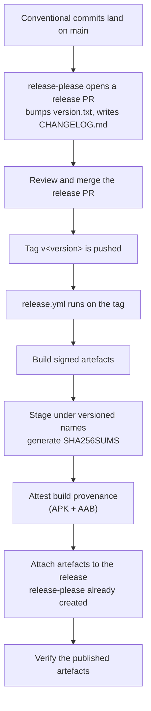

# Release process

Distribution is **GitHub Releases only**. No Google Play, no F-Droid, no
fastlane, no store metadata, no Play service-account secret anywhere in the
repository. If you find an OllamaMobile listing on an app store, it is not this
project.

Current version: **0.1.0**.

## Versioning

One file is authoritative: `version.txt` at the repository root. Nothing else
carries a version string.

`app/build.gradle.kts` reads it and derives both Android version fields:

```kotlin
versionName = "1.2.3"                          // verbatim from version.txt
versionCode = 1 * 1_000_000 + 2 * 10_000 + 3 * 100   // 1_020_300
```

The `× 100` on the patch component leaves ninety-nine spare slots per patch
release. That is not for hotfixes — it is so that if per-ABI APK splits ever ship,
each split can take a distinct `versionCode` without disturbing the scheme, which
is the one thing Android will not let you change retroactively.

A pre-release suffix (`0.2.0-rc.1`) is kept in `versionName` and stripped when
computing `versionCode`, so a release candidate and its final release sort
identically as far as the platform is concerned.

`version.txt` is owned by release-please. Do not hand-edit it in a feature
branch; write [Conventional Commits](https://www.conventionalcommits.org/) and
let the release pull request carry the bump.

## Signing

Release signing is opt-in, and the fallback is deliberately loud.

The build looks for a `keystore.properties` at the repository root, then for
these environment variables:

| Variable | Meaning |
| --- | --- |
| `OLLAMA_KEYSTORE_PATH` | Path to the keystore file |
| `OLLAMA_KEYSTORE_PASSWORD` | Store password |
| `OLLAMA_KEY_ALIAS` | Key alias |
| `OLLAMA_KEY_PASSWORD` | Key password |

If neither is present, `assembleRelease` **still succeeds** — signed with the
debug key, after printing:

> No keystore.properties and no OLLAMA_KEYSTORE_* env vars: signing the release
> build with the DEBUG key. This artefact must not be published.

!!! danger "A debug-signed release build must never be published"
    The debug key is not secret; anyone can produce an artefact that appears to
    be from this project. The fallback exists so a contributor can run
    `assembleRelease` locally to check R8 output, size and shrinking behaviour
    without holding release material. It is a development convenience, not a
    release path.

The reason for a fallback at all is that failing the build outright would make
`assembleRelease` unrunnable for every contributor, and R8-only problems — a
missing keep rule, a shrinking regression — would then only ever surface in the
release pipeline, which is the worst possible place to find them.

`keystore.properties` and any `*.jks` or `*.keystore` file are gitignored.
Release signing material lives in GitHub Actions secrets and is available only
to the tag-triggered release workflow, never to pull-request runs.

## Cutting a release



### 1. Merge the release pull request

release-please maintains it from the commits on `main`: it bumps `version.txt`
and updates `CHANGELOG.md`. Read the changelog it produced — it is generated
from commit subjects, and a commit subject written carelessly becomes a release
note written carelessly.

### 2. The tag triggers the build

Merging the release pull request pushes `v<version>`, and `release.yml` runs on
the tag. Releases are built **from the tag**, never from a local machine, so the
published artefact corresponds to a commit anyone can check out.

### 3. What gets published

Gradle's own output names (`app-release.apk`, `mapping.txt`) never reach the
release page. `release.yml` stages everything into `dist/` under versioned names
first, because a file called `app-release.apk` sitting in a downloads folder next
to three other Android projects is unidentifiable, and because a stack trace
arriving in an issue six months from now has to be matched to the right mapping
file.

| Published artefact | Notes |
| --- | --- |
| `ollama-mobile-<version>-arm64-v8a.apk` | The file users install. The ABI is in the name because it is a hard requirement, not a variant. |
| `ollama-mobile-<version>.aab` | Built for completeness. Nothing consumes it — there is no store to upload to. |
| `mapping-<version>.txt` | R8 mapping, for de-obfuscating a stack trace from a user report. The build fails if it is missing, because `isMinifyEnabled = true` means it must exist. |
| `native-debug-symbols-<version>.zip` | Unstripped native symbols, from `debugSymbolLevel = "FULL"`. **Only present when the build contains `.so` files** — that is, `-Pollama.nativeSource=build` or `prebuilt`. With the current default of `none` its absence is expected and is not an error, so a 0.1.0 release would not carry it. |
| `SHA256SUMS` | Checksums over every other file in `dist/`, generated in a temp file so it never hashes itself. |

Build provenance is attested for the APK and the AAB via
`actions/attest-build-provenance`. Verify a download with:

```bash
gh attestation verify ollama-mobile-<version>-arm64-v8a.apk \
  --repo jaypetez/ollama-mobile
```

Release builds package `arm64-v8a` only. The `x86_64` ABI carried by debug
builds exists solely so instrumentation tests can run on an emulator on hosted
runners; shipping it in a release would add weight for a configuration no phone
uses.

Whether the release includes native inference depends on `-Pollama.nativeSource`,
which `release.yml` currently leaves at its `none` default. At 0.1.0 there is no
`third_party/llama.cpp` submodule and no prebuilt artefact, so a release cut
today would contain **no native code and no local inference at all** — and,
since the feature modules are empty, no remote client either. The release notes
must say what the build can actually do rather than leaving a reader to discover
it. When native artefacts exist, the release pipeline is intended to consume them
via `prebuilt` rather than compiling `llama.cpp` inline; see [CI](ci.md).

!!! warning "Status"
    No release has been cut. `release.yml` has never run against a real tag, so
    everything on this page is verified by reading the workflow, not by having
    watched it work. The signing secrets are not set, and the first run is where
    a mismatch between the staging step's `find` expressions and AGP's actual
    output layout would surface.

### 4. Verify before announcing

Download the published assets into an empty directory first. The commands below
name the files as they are actually attached to the release — substitute the real
version for `<version>`.

- Checksums match what the workflow produced:

    ```bash
    sha256sum -c SHA256SUMS --ignore-missing
    ```

- The APK contains `arm64-v8a` shared objects and no `x86_64` ones — only
  meaningful if the build included native code; with `nativeSource=none` this
  correctly prints nothing:

    ```bash
    unzip -l ollama-mobile-<version>-arm64-v8a.apk | grep '\.so$'
    ```

- The APK is signed with the release key, not the debug key:

    ```bash
    apksigner verify --print-certs ollama-mobile-<version>-arm64-v8a.apk
    ```

- Provenance verifies against this repository:

    ```bash
    gh attestation verify ollama-mobile-<version>-arm64-v8a.apk \
      --repo jaypetez/ollama-mobile
    ```

- The release notes state which inference modes the build actually supports.

!!! warning "Install verification is unverified"
    Nobody has installed a published release on a physical arm64 device, because
    there is not one. Until that changes, "it installs and runs" is an untested
    claim. See [Verification status](verification-status.md).

## Release notes

Written for someone deciding whether to install this build. In order:

1. **What changed**, from the generated changelog.
2. **What this build can do** — remote client only, or local inference included.
   Do not make a reader infer it.
3. **Anything that requires user action** — a database migration, a settings
   reset, a model that must be re-downloaded.
4. **Known unverified behaviour.** Every release links
   [Verification status](verification-status.md), because the honest answer to
   "how fast is it" has not changed.
5. **Attribution**: MIT, Copyright (c) 2026 Jayson Petersen. Builds containing
   native inference also carry the `llama.cpp` notice — MIT, Copyright (c)
   2023-2024 The ggml authors.

**Never put a performance number in a release note.** There is no measurement
behind one.

## Hotfixes

Branch from the tag, fix, and let release-please produce a patch bump. Do not
hand-edit `version.txt` — the pipeline reads it, and a hand-written value that
disagrees with the tag produces an artefact whose `versionCode` does not match
its name.

## Updating installed copies

Android does not auto-update a sideloaded app. Users watch the releases page. A
release with a security fix should say so in the first line of its notes,
because that first line is all the notification a user will get.

## Deliberately absent

- Google Play and F-Droid. No account, no review pipeline, no key held by a
  third party, and no data-safety declaration process, in exchange for
  discoverability the project does not need.
- fastlane and store metadata. Nothing to feed.
- Any beta or staged rollout channel. One release, one tag, one page.
- Auto-update inside the app. It would mean the app fetching a remote manifest
  on a schedule — a network request the user did not ask for. See
  [Privacy](privacy-policy.md).
