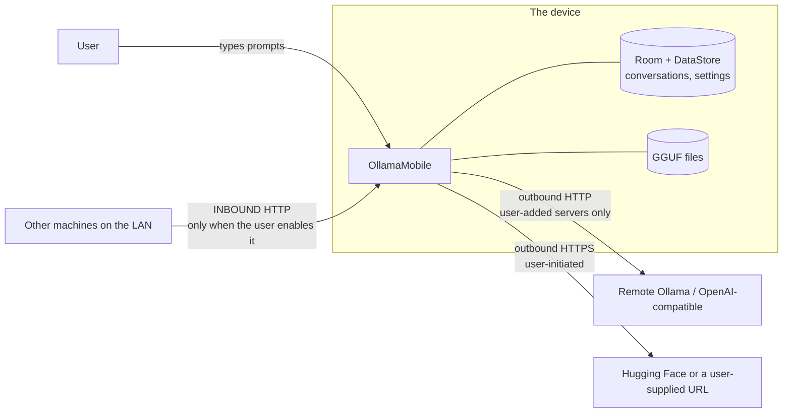
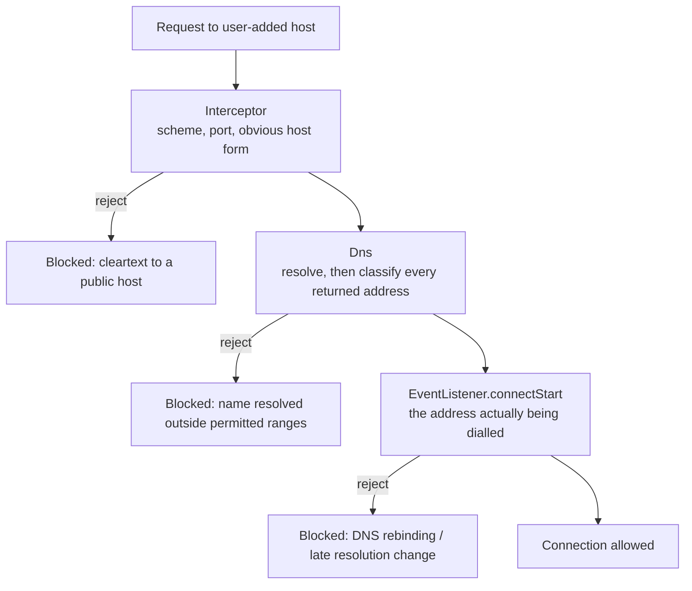

# Security model

This is the developer-facing companion to
[`SECURITY.md`](https://github.com/jaypetez/ollama-mobile/blob/main/SECURITY.md)
in the repository root. That file tells a reporter how to reach us; this one
explains what the app defends against, what it deliberately does not, and why
two specific decisions that look wrong at first glance are correct.

Report vulnerabilities to <jayson@shoe4africa.org>. Do not open a public issue.

!!! warning "Status"
    **Almost nothing on this page is implemented at 0.1.0.** `:server`,
    `:core-common`, `:core-remote`, `:core-storage`, `:core-download`,
    `:core-ml`, `:core-data` and `:core-llm` contain no Kotlin sources, and
    there is no C or C++ in the repository at all — so there is no HTTP server
    to expose, no `LanOnlyGuard` to enforce, no GGUF loader to attack and no
    credential store to break into.

    This page is the **specification** the implementation will be held to,
    written before the code so the code can be reviewed against it. Verbs are
    future tense wherever the present tense would state something false.

    Two things here *are* true today, and they are the two that live in build
    configuration rather than in code: the module-layering prohibitions that
    `checkModuleGraph` enforces, and the backup-exclusion rules in the manifest
    resources. Per-claim detail is in
    [Verification status](verification-status.md).

## What OllamaMobile actually is, from a security standpoint

Three surfaces, with very different exposure:

Only one of those arrows points inward. That asymmetry drives most of what
follows.

## Threat model

### In scope

**A hostile machine on the same network.** When the embedded server is enabled,
anything that can route to the phone can send it requests. This is the highest
-consequence surface in the product and it is why `checkModuleGraph` forbids
`:server` from depending on `:core-data`, `:core-storage`, `:core-download` or
`:core-llm` — a request handler that cannot see the download manager cannot be
tricked into starting a download, and one that cannot see the database cannot be
tricked into reading conversations. See
[Module map](architecture/module-map.md). The server is off by default, binds
only when the user turns it on, and supports a bearer token; see
[Enabling LAN access](server/enabling-lan.md).

**A hostile or compromised remote server.** A server the user added returns
data the app parses and renders. Malformed JSON, absurd content lengths, streams
that never terminate, and markdown crafted to abuse the renderer are all things
a remote can do. Parsing is defensive, streams have limits, and markdown is
rendered without any HTML or script execution path.

**A malicious model file.** GGUF from an arbitrary URL is untrusted input parsed
by native code. This is the sharpest edge in the product: a parser bug in a C++
library reading attacker-controlled bytes. Mitigations are containment rather
than prevention — one module sees `llama.cpp`, the parse happens in-process with
no elevated capability, and the backend quarantine ledger in `:core-ml` records
a backend that crashed so the app does not re-enter the same crash on next
launch. Users are told where a model came from.

**Another app on the device.** App-private storage, no exported components
beyond the launcher activity, no content provider exposing model files or the
database.

**Physical access to an unlocked device.** Optional biometric lock on app entry
(`androidx.biometric`). This is a speed bump, not full-disk encryption.

**Passive network observation.** Cleartext to a LAN server is visible on that
LAN. The app does not pretend otherwise; it tells the user when a connection is
not encrypted rather than showing a padlock it has not earned.

### Explicitly out of scope

**A rooted or compromised device.** Root reads app-private storage and process
memory. Nothing here survives that and no anti-root theatre is attempted.

**Malicious model *content* — prompt injection.** A model, or a document pulled
into RAG context, can produce text designed to manipulate the user or to steer
subsequent turns. This is not solvable at the app layer. What the app does is
never grant a model authority: there is no tool-calling that touches the device,
no filesystem access from generated text, and nothing generated is ever executed.

**Traffic analysis, and the remote server's own behaviour.** If a user points
the app at a hosted endpoint, that endpoint sees the prompts. The app cannot fix
that; it can only be clear that it is happening. See
[Privacy](privacy-policy.md).

**Supply chain beyond pinning.** Dependencies are pinned in a version catalogue
and bumped through pull requests so CI proves the change. There is no
reproducible-build guarantee and no artefact attestation at 0.1.0.

## The cleartext decision, in full

This is the decision most likely to be flagged by an automated scan, so here is
the entire reasoning rather than a one-line defence.

### What the app does

`android:networkSecurityConfig` sets `cleartextTrafficPermitted="true"` in the
base config. Release builds trust the system CA store only; debug builds
additionally trust user-installed CAs so a developer can proxy traffic with
mitmproxy or Charles. Enforcement of *where* cleartext may go lives in code, in
`LanOnlyGuard` in `:core-common`.

### Why the platform mechanism cannot do this job

The requirement is: **permit plain HTTP to private-range addresses; refuse it to
the public internet.**

An Android network security config cannot express that. The configuration
language offers `<domain>` elements, and a `<domain>` accepts a hostname or an
IP literal. It does not accept a CIDR range. There is no `<cidr>` element, no
wildcard that means "the 192.168.0.0/16 block", and no predicate for "an address
on the local subnet". `<domain includeSubdomains="true">` widens across DNS
labels, which is a different axis entirely and no help for IP literals.

Even if CIDR ranges were expressible, a network security config is a **static
resource compiled into the APK**. The hosts a user adds are typed in at runtime.
There is no build-time set to enumerate: today it is `192.168.1.50`, tomorrow it
is `pi.local`, next week it is a Tailscale name. A static allowlist would have
to be either empty — breaking the app's primary function — or `*`, which is what
`cleartextTrafficPermitted="true"` already is, only expressed less honestly.

The remaining option is to disallow cleartext entirely and require HTTPS.
That would mean telling every user with an Ollama server on a Raspberry Pi —
which listens on plain HTTP on port 11434 and has no certificate, because there
is no certificate authority that will issue one for `192.168.1.50` — that the
app does not work for them. That is the majority of the intended audience.

### What actually enforces the policy

`LanOnlyGuard`, which filters at three layers of the OkHttp stack. Three,
because each catches something the others cannot:

- **`Interceptor`** sees the request before anything happens. It applies the
  cheap checks — scheme, port, and whether the host is an IP literal in a
  permitted range — and rejects early with a message the UI can explain.
- **`Dns`** classifies what a hostname resolves to. A name like `evil.example`
  can resolve to anything, so classification has to happen after resolution, not
  on the string.
- **`EventListener.connectStart`** sees the concrete `InetSocketAddress` OkHttp
  is about to dial. This is the layer that closes DNS rebinding: a resolver that
  returned a private address at check time and a public one at connect time gets
  caught here, because this hook runs on the address actually used.

This is strictly more expressive than a static resource could be. It can consult
the live network policy (the user's offline and LAN-only settings), resolve the
device's actual subnet, distinguish transports, and produce a specific error
message instead of a generic connection failure. `:core-common` also carries
Konsist architecture tests asserting there is no second `OkHttpClient`, no
custom `TrustManager` and no bare `Socket` anywhere in the codebase — because
the guard is only as good as its monopoly on outbound connections.

!!! warning "Unit-tested, not device-tested"
    The guard's decision logic is covered by unit tests. End-to-end enforcement
    on a physical device has not been observed. See
    [Verification status](verification-status.md).

### Why the CGNAT range 100.64.0.0/10 is allowed over a VPN

`100.64.0.0/10` is not RFC1918. It is RFC 6598 shared address space, intended
for carrier-grade NAT, and treating it as "local" is wrong in the general case:
on a mobile carrier's network, a 100.64 address is other customers, not your
house.

It is nevertheless permitted **when the transport is a VPN interface**, and the
reason is entirely practical: that is Tailscale. Tailscale assigns every node an
address from `100.64.0.0/10`, and reaching a home Ollama server from outside the
house over Tailscale is the single most common way people actually do this.
WireGuard and other overlays land in similar territory.

Refusing it would mean the app works on your sofa and stops working at a café,
for a connection that is end-to-end encrypted by WireGuard and authenticated by
the user's own tailnet — which is *better* protected than the RFC1918 cleartext
we permit without argument. The rule would be punishing the safer setup.

The condition is the important half. The permission is scoped to the transport:
the address is allowed when it is reachable over a VPN interface, not merely
because it falls in `100.64/10`. On a carrier-NAT path with no VPN, the range is
treated as public and cleartext to it is refused.

| Range | Cleartext | Note |
| --- | --- | --- |
| `10/8`, `172.16/12`, `192.168/16` | Permitted | RFC1918 — the ordinary home LAN case |
| `127/8` | Permitted | Loopback, including the app's own server |
| `169.254/16` | Permitted | Link-local |
| `fc00::/7`, `fe80::/10` | Permitted | IPv6 unique-local and link-local |
| `100.64/10` | Permitted **over a VPN transport only** | Tailscale and similar overlays |
| Everything else | Refused for cleartext | HTTPS is required |

## Other decisions worth knowing about

**No custom `TrustManager`, ever.** Certificate pinning against a server the
user chose at runtime is meaningless, and every custom trust manager in the wild
is one refactor away from being an accept-all. Konsist enforces the absence.

**One `OkHttpClient`.** A second client is a second connection pool, a second
set of interceptors, and a hole in the guard. Also enforced by Konsist.

**R8 full mode** is on for release builds. It is not a security boundary — treat
obfuscation as making an attacker's afternoon longer, not their attack
impossible — but it does shrink the reachable surface. Note the interaction with
JNI: full-mode renaming is exactly why natives are bound with `RegisterNatives`
rather than by symbol name. See [JNI boundary](architecture/jni-boundary.md).

**Backup rules** exclude the conversation database and any credentials from
cloud backup. A user's chat history should not travel to a Google account
because a default was left on.

**Foreground services declare their type** and run only while their work runs.
The wake lock is held for the generation window, not for the app's lifetime.

**No telemetry is a security property, not only a privacy one.** There is no
analytics endpoint to be compromised, no crash payload that could contain prompt
text, and no third-party SDK in the binary with its own network access. See
[Privacy](privacy-policy.md).

## If you are reviewing this project

The places worth your attention, in order:

1. `LanOnlyGuard` in `:core-common` — the whole cleartext argument rests on it.
2. `:server` request handling — the only inbound surface.
3. The GGUF load path in `:core-llm` — untrusted bytes into native code.
4. The download path in `:core-download` — URL handling, redirects, integrity.
5. `checkModuleGraph` — if the layering rules can be bypassed, mitigations 1 and
   2 above weaken together.
